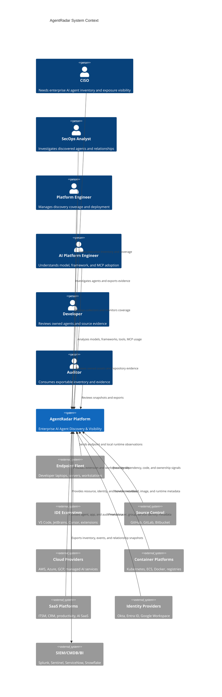
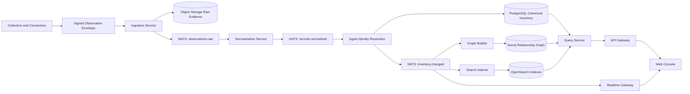
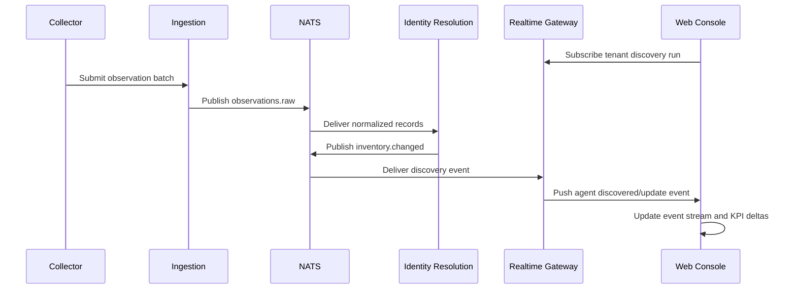

# 02 - Product Architecture

## Overview

AgentRadar is a multi-source discovery and visibility platform that ingests observations from endpoints, IDEs, repositories, cloud accounts, containers, SaaS applications, browser environments, MCP configurations, local LLM runtimes, and autonomous execution platforms. The system normalizes those observations into canonical assets, resolves agent identities, builds relationships in a graph, indexes inventory for search, streams events to the UI, and exposes enterprise APIs for export and integration.

The architecture follows four product principles:

1. **Collect broadly** across enterprise AI surfaces.
2. **Normalize deterministically** into versioned schemas.
3. **Represent relationships graph-first** for topology, lineage, and investigation.
4. **Serve fast operational views** through query-optimized stores and realtime channels.

## C4 Level 1: System Context



## C4 Level 2: Container View

```mermaid
C4Container
    title AgentRadar Container Architecture

    Person(user, "Enterprise User", "Security, platform, AI, developer, auditor personas")

    Container(web, "Web Console", "React/TypeScript", "Inventory, topology, search, settings, dashboards")
    Container(api, "API Gateway", "Node/Go", "REST, auth, rate limits, request routing")
    Container(stream, "Realtime Gateway", "WebSocket/SSE", "Live discovery events and UI subscriptions")

    Container(collectorMgmt, "Collector Management Service", "Go", "Collector enrollment, config, health, upgrades")
    Container(ingestion, "Ingestion Service", "Go", "Receives observations and validates envelopes")
    Container(normalize, "Normalization Service", "Python/Go", "Maps source observations to canonical records")
    Container(identityResolution, "Agent Identity Resolution Service", "Python", "Deduplication and confidence scoring")
    Container(graphBuilder, "Graph Builder Service", "Go", "Creates and updates graph relationships")
    Container(searchIndexer, "Search Indexer Service", "Go", "Projects inventory into OpenSearch")
    Container(exporter, "Export Service", "Go", "CSV, JSON, NDJSON, Parquet, SIEM/CMDB exports")
    Container(query, "Query Service", "Go", "Inventory, graph, timeline, and search APIs")
    Container(authz, "AuthZ Service", "Go", "RBAC, scopes, tenant policy, audit checks")

    ContainerDb(pg, "PostgreSQL", "Relational DB", "Canonical inventory, tenants, users, configs, snapshots")
    ContainerDb(neo4j, "Neo4j", "Graph DB", "Agent relationships and topology traversals")
    ContainerDb(os, "OpenSearch", "Search Index", "Full-text and faceted inventory search")
    ContainerQueue(nats, "NATS JetStream", "Event Bus", "Observation, normalization, graph, timeline events")
    ContainerDb(redis, "Redis", "Cache", "Sessions, query cache, locks, realtime fanout state")
    ContainerDb(obj, "Object Storage", "S3/GCS/Azure Blob", "Raw evidence, exports, large snapshots")

    System_Ext(collectors, "Collectors and Connectors", "Endpoint, cloud, SaaS, repo, browser, MCP")

    Rel(user, web, "Uses")
    Rel(web, api, "REST/JSON")
    Rel(web, stream, "Realtime subscriptions")
    Rel(api, authz, "Authorize")
    Rel(api, query, "Query requests")
    Rel(api, exporter, "Export requests")
    Rel(stream, nats, "Subscribe to event topics")
    Rel(collectors, collectorMgmt, "Enroll, receive config")
    Rel(collectors, ingestion, "Post signed observations")
    Rel(ingestion, nats, "Publish raw observations")
    Rel(normalize, nats, "Consume observations, publish normalized records")
    Rel(identityResolution, nats, "Consume normalized records, publish identity updates")
    Rel(graphBuilder, nats, "Consume identity and relationship events")
    Rel(searchIndexer, nats, "Consume inventory change events")
    Rel(query, pg, "Read/write canonical inventory")
    Rel(query, neo4j, "Traverse graph")
    Rel(query, os, "Search and facets")
    Rel(query, redis, "Cache hot queries")
    Rel(ingestion, obj, "Store raw evidence")
    Rel(normalize, pg, "Write canonical observations")
    Rel(identityResolution, pg, "Update agent entities")
    Rel(graphBuilder, neo4j, "Upsert nodes and edges")
    Rel(searchIndexer, os, "Index documents")
    Rel(exporter, pg, "Read inventory snapshots")
    Rel(exporter, neo4j, "Read relationships")
    Rel(exporter, os, "Read result sets")
    Rel(exporter, obj, "Write export artifacts")
```



## Data Stores

| Store | Role | Primary Data | Why It Exists |
|---|---|---|---|
| PostgreSQL | Canonical system of record | Tenants, users, collectors, observations metadata, normalized assets, snapshots, exports, settings | Strong consistency, transactions, relational constraints, reporting joins. |
| Neo4j | Relationship and topology store | Agents, tools, models, identities, devices, repos, clouds, MCP servers, SaaS assets, relationship edges | Fast multi-hop traversals and graph-native investigation. |
| OpenSearch | Search and faceting | Denormalized inventory documents, evidence snippets, events, saved query result materializations | Full-text search, aggregations, fast filters, sortable tables. |
| NATS JetStream | Event backbone | Raw observations, normalized records, inventory changes, graph updates, discovery events, realtime notifications | Durable event streams, service decoupling, replay, backpressure. |
| Redis | Low-latency state | Sessions, query cache, feature flags cache, distributed locks, realtime presence and fanout state | Fast ephemeral access and load shedding. |
| Object Storage | Large evidence and artifacts | Raw source payloads, compressed evidence bundles, exports, historical snapshots | Cost-effective durable storage for non-query-heavy payloads. |

## Discovery-to-UI Flow



## Core Microservices

### API Gateway

Responsibilities:

- Terminate authenticated API requests.
- Enforce tenant context.
- Apply rate limits and request size limits.
- Route to query, export, settings, collector management, and admin services.
- Emit audit events for read/export/configuration activity.

Implementation notes:

- REST over JSON for broad enterprise compatibility.
- Use opaque pagination cursors for large inventory result sets.
- Include `request_id`, `tenant_id`, `actor_id`, and `scope` in structured logs.
- Never query data stores directly from UI clients.

### Collector Management Service

Responsibilities:

- Collector enrollment and key rotation.
- Collector configuration delivery.
- Source coverage tracking.
- Connector health and version inventory.
- Upgrade channel assignment.

Key concepts:

- Collector identity is separate from human identity.
- Collectors receive scoped credentials and source-specific config.
- Health signals are first-class coverage inputs.
- Every collector reports capabilities so UI can distinguish "not configured" from "unsupported".

### Ingestion Service

Responsibilities:

- Accept signed observation batches.
- Validate schema envelope and tenant routing.
- Persist raw evidence payloads.
- Publish observations to NATS.
- Reject invalid, oversized, replayed, or unauthorized submissions.

Observation envelope minimum:

```json
{
  "schema_version": "observation.v1",
  "tenant_id": "ten_123",
  "source_type": "ide",
  "source_id": "collector_456",
  "observed_at": "2026-07-10T11:10:00Z",
  "idempotency_key": "sha256:...",
  "payload_ref": "s3://...",
  "payload_hash": "sha256:...",
  "records_count": 42
}
```

### Normalization Service

Responsibilities:

- Convert source-specific observations into canonical records.
- Preserve source evidence and source-native identifiers.
- Apply schema validation and default confidence seeds.
- Enrich records with known provider, framework, model, tool, and MCP taxonomies.
- Publish normalized records and data quality events.

See [11-normalization-pipeline.md](./11-normalization-pipeline.md).

### Agent Identity Resolution Service

Responsibilities:

- Determine whether observations represent a new or existing agent.
- Merge evidence across IDE, process, repo, cloud, container, SaaS, and MCP signals.
- Assign stable `agent_id`.
- Compute confidence and relationship confidence.
- Prevent unsafe merges by requiring evidence thresholds.

See [12-agent-identity-resolution.md](./12-agent-identity-resolution.md).

### Graph Builder Service

Responsibilities:

- Upsert graph nodes for canonical assets.
- Upsert relationship edges with evidence and confidence.
- Maintain current graph and historical relationship changes.
- Emit graph mutation events for realtime topology updates.

Graph updates must be idempotent and replay-safe.

### Search Indexer Service

Responsibilities:

- Build denormalized documents for inventory search.
- Maintain indexes for agents, tools, models, MCP servers, devices, repositories, clouds, identities, and events.
- Support zero-downtime reindexing through versioned aliases.
- Emit indexing lag metrics.

### Query Service

Responsibilities:

- Serve inventory lists and detail pages.
- Execute graph traversals and topology queries.
- Retrieve timelines and discovery events.
- Apply RBAC and field-level visibility.
- Compose responses from PostgreSQL, Neo4j, OpenSearch, Redis, and object storage.

### Export Service

Responsibilities:

- Generate synchronous small exports and asynchronous large exports.
- Preserve query filters and snapshot timestamps.
- Support CSV, JSON, NDJSON, and Parquet.
- Write export artifacts to object storage.
- Emit audit events for every export.

## Event-Driven Architecture

### Topic Families

| Topic | Producer | Consumers | Purpose |
|---|---|---|---|
| `observations.raw` | Ingestion | Normalization, archive QA | Durable raw observation stream. |
| `observations.rejected` | Ingestion | Ops, data quality | Invalid or unauthorized batches. |
| `records.normalized` | Normalization | Identity resolution | Canonical asset candidates. |
| `records.quarantined` | Normalization | Ops, connector owners | Records requiring schema or mapping review. |
| `inventory.changed` | Identity resolution | Graph builder, search indexer, realtime | Agent or asset create/update/delete events. |
| `relationships.changed` | Graph builder | Search indexer, realtime, timeline | Relationship mutation events. |
| `discovery.events` | All pipeline services | UI, timeline, exports | User-visible discovery event stream. |
| `collector.health` | Collectors | Collector management, coverage UI | Collector liveness and capability data. |
| `exports.completed` | Export service | UI notifications, audit | Export lifecycle updates. |

### Event Requirements

- Every event includes `event_id`, `tenant_id`, `occurred_at`, `published_at`, and `schema_version`.
- Events are immutable after publish.
- Consumers are idempotent.
- Event replay must not create duplicate canonical assets.
- Dead-letter topics retain failed records with failure reason, service version, and retry count.

## Tenancy Model

AgentRadar is tenant-isolated by default.

- Every row, node, edge, index document, object-storage key, event, and cache key includes `tenant_id`.
- Services derive tenant context from authenticated request or signed collector credentials.
- Cross-tenant operations are reserved for internal control plane jobs and require explicit service scopes.
- Tenant-specific encryption keys should be supported for object storage and sensitive database fields.

## Authentication and Authorization

High-level model:

- Human access through enterprise SSO.
- API access through scoped service tokens.
- Collector access through enrolled collector identities and rotated signing keys.
- RBAC roles aligned to personas: executive viewer, operations analyst, platform admin, AI platform viewer, developer scoped viewer, auditor.

Authorization applies to:

- Screens and APIs.
- Export actions.
- Tenant settings.
- Source configuration.
- Evidence fields.
- Sensitive identity and device attributes.

See [19-security-and-access-control.md](./19-security-and-access-control.md).

## Realtime Architecture

Realtime is useful for discovery runs, event streams, topology changes, collector health, and export completion. It is not required for every table refresh.



Realtime constraints:

- Use server-side filtering by tenant, topic, and allowed scopes.
- Collapse high-volume changes into summary events for dashboard widgets.
- Prefer SSE for simple event feeds and WebSocket for bidirectional graph sessions.
- Include reconnect cursors so clients can resume after disconnects.

## Read Model Strategy

AgentRadar uses purpose-built read models:

- PostgreSQL for canonical detail pages and transactional state.
- OpenSearch for global search, facets, and high-cardinality filters.
- Neo4j for topology and relationship exploration.
- Redis for hot dashboards, frequent facets, and session-level graph expansion cache.

The UI should not assume one datastore. Query Service composes read models behind stable API contracts.

## Write Model Strategy

The write path is append-friendly and event-driven:

1. Raw observation is accepted and stored.
2. Normalized record is produced.
3. Identity resolution upserts canonical inventory.
4. Graph builder creates relationships.
5. Search indexer projects read documents.
6. Timeline and realtime event streams are updated.

Strong consistency is required for canonical inventory writes. Eventual consistency is acceptable for graph and search projections if the UI exposes indexing/discovery status.

## Failure Modes and Degradation

| Failure | Expected Behavior | User Experience |
|---|---|---|
| OpenSearch unavailable | Inventory detail still works; search degraded. | Banner on search pages, retryable queries, no data corruption. |
| Neo4j unavailable | Tables and detail pages work; topology unavailable. | Topology map shows service degradation state. |
| NATS lag | Pipeline slows; ingestion applies backpressure. | Discovery run shows processing lag. |
| Collector offline | Coverage status changes; no false deletion. | Source coverage gap visible. |
| Object storage unavailable | Ingestion rejects raw evidence persistence or queues retry depending mode. | Connector health/data quality warning. |
| Identity resolution uncertain | Do not merge aggressively. | Asset appears as low-confidence or possible duplicate. |

## Deployment Topology

AgentRadar should support:

- Multi-tenant SaaS deployment.
- Customer-managed single-tenant deployment for regulated enterprises.
- Hybrid collectors connecting outbound to SaaS control plane.
- Region-local storage for data residency.

See [24-deployment-architecture.md](./24-deployment-architecture.md).

## Scale Assumptions

Initial enterprise target:

- 100,000 endpoints.
- 20,000 repositories.
- 5,000 cloud accounts/projects/subscriptions.
- 1,000 Kubernetes clusters.
- 250 SaaS tenants/apps.
- 1 million raw observations per hour.
- 500,000 canonical assets.
- 5-20 million graph relationships.
- Search queries under 1.5 seconds p95 for common filters.
- Topology neighborhood queries under 2 seconds p95 for two-hop expansions.

See [27-performance-and-scale.md](./27-performance-and-scale.md).

## Architecture Decisions

| Decision | Rationale |
|---|---|
| Use PostgreSQL as canonical store | Reliable transactions, mature operations, strong tenant and snapshot modeling. |
| Use Neo4j for relationship graph | Multi-hop traversals and topology are core product interactions. |
| Use OpenSearch for inventory search | Faceted search and text search are primary analyst workflows. |
| Use NATS JetStream for pipeline events | Lightweight durable streams, replay, service decoupling. |
| Use Redis only for ephemeral state | Avoid making cache state authoritative. |
| Preserve raw evidence in object storage | Enables reprocessing, audit, debugging, and connector improvements. |
| Keep governance out of core services | Prevents architectural coupling to enforcement workflows not in scope. |

## Related Documents

- [05-information-architecture.md](./05-information-architecture.md)
- [10-collector-architecture.md](./10-collector-architecture.md)
- [11-normalization-pipeline.md](./11-normalization-pipeline.md)
- [13-graph-data-model.md](./13-graph-data-model.md)
- [14-inventory-data-model.md](./14-inventory-data-model.md)
- [22-backend-services.md](./22-backend-services.md)
