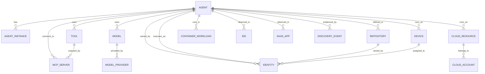

# 05 - Information Architecture

## Overview

Visentra's information architecture defines the canonical object model for enterprise AI agent discovery and visibility. The model must support inventory tables, topology graphs, search, timelines, exports, RBAC, evidence provenance, and future visibility depth without introducing governance/remediation semantics.

The key design rule is: **every canonical asset is evidence-backed and relationship-aware**.

## Object Model Summary



## Canonical Entity Requirements

All major entities share a base envelope.

| Attribute | Type | Description |
|---|---|---|
| `id` | string | Stable Visentra identifier. |
| `tenant_id` | string | Tenant boundary. |
| `entity_type` | enum | Agent, Device, IDE, Model, Tool, MCP Server, Cloud, Identity, Repository, etc. |
| `display_name` | string | Human-readable name. |
| `normalized_name` | string | Searchable normalized name. |
| `status` | enum | Active, dormant, stale, deleted, unknown. |
| `confidence` | integer 0-100 | Confidence in identity and classification. |
| `first_seen_at` | timestamp | First observation time. |
| `last_seen_at` | timestamp | Most recent observation time. |
| `created_at` | timestamp | Canonical entity creation time. |
| `updated_at` | timestamp | Last canonical update time. |
| `source_count` | integer | Number of distinct sources contributing evidence. |
| `sources` | array | Source summaries with type, ID, first/last seen, confidence. |
| `tags` | array | User/system tags, not enforcement labels. |
| `business_unit` | string | Optional org metadata. |
| `team` | string | Optional team metadata. |
| `owner_identity_id` | string | Best-known owner when resolved. |
| `evidence_refs` | array | References to source evidence objects. |
| `schema_version` | string | Canonical schema version. |

## Agent

The Agent entity is the central object. It represents an autonomous or semi-autonomous AI system, coding assistant, workflow agent, local agent process, SaaS agent, browser agent, MCP-enabled assistant, or framework-defined runtime.

### Agent Classification

| Class | Description | Examples |
|---|---|---|
| `coding_agent` | Agent embedded in or adjacent to IDE/developer workflow. | Cursor agent, VS Code agent extension, JetBrains AI workflow. |
| `local_agent` | Local process, CLI, daemon, or desktop runtime. | agent CLI, AutoGPT process, local assistant daemon. |
| `framework_agent` | Agent defined through an agent framework in code. | LangChain agent, CrewAI crew, AutoGen agent. |
| `cloud_agent` | Agent running in cloud infrastructure or managed AI service. | Lambda agent worker, Kubernetes pod, Bedrock agent. |
| `container_agent` | Containerized agent runtime. | Docker worker, Kubernetes deployment, ECS task. |
| `saas_agent` | Agent surfaced through SaaS application. | CRM assistant, ITSM virtual agent, productivity AI agent. |
| `mcp_enabled_agent` | Agent connected to one or more MCP servers. | IDE assistant with MCP config. |
| `browser_agent` | Browser extension or web automation agent. | Agentic Chrome extension. |
| `autonomous_agent` | Scheduled or unattended task-loop agent. | CI agent, cron agent, queue worker. |
| `unknown_agent` | Evidence indicates agentic behavior but classification is incomplete. | Low-confidence candidate. |

### Agent Attributes

| Attribute | Type | Required | Description |
|---|---|---|---|
| `agent_id` | string | Yes | Stable canonical ID. |
| `name` | string | Yes | Best display name. |
| `aliases` | array | No | Source-native names, process names, repo names, SaaS labels. |
| `description` | string | No | Source or inferred description. |
| `agent_class` | enum | Yes | Classification from table above. |
| `agent_subtype` | string | No | Connector-specific subtype. |
| `autonomy_level` | enum | No | manual, assisted, semi_autonomous, autonomous, unknown. |
| `deployment_state` | enum | No | development, test, staging, production, personal, unknown. |
| `runtime_type` | enum | No | ide, local_process, container, serverless, vm, saas, browser, ci, notebook, unknown. |
| `execution_mode` | enum | No | interactive, scheduled, event_driven, long_running, batch, unknown. |
| `owner_identity_id` | string | No | Best-known owner. |
| `owner_team` | string | No | Owning team. |
| `business_unit` | string | No | Business unit. |
| `environment` | string | No | prod/stage/dev/personal/lab. |
| `criticality` | enum | No | low, medium, high, critical, unknown; visibility metadata only. |
| `confidence` | int | Yes | Agent identity/classification confidence. |
| `confidence_reasons` | array | Yes | Evidence reasons that explain score. |
| `first_seen_at` | timestamp | Yes | First observed. |
| `last_seen_at` | timestamp | Yes | Last observed. |
| `last_activity_at` | timestamp | No | V2 activity signal. |
| `dormant_since` | timestamp | No | Derived when not observed beyond threshold. |
| `source_categories` | array | Yes | IDE, Local, Framework, Cloud, Containers, SaaS, MCP, Local LLM, Browser, Autonomous. |
| `source_native_ids` | array | Yes | Native IDs keyed by source. |
| `frameworks` | array | No | Frameworks associated with agent. |
| `models` | array | No | Related model IDs. |
| `model_providers` | array | No | Provider names for faceting. |
| `tools` | array | No | Related tool IDs. |
| `mcp_servers` | array | No | Related MCP server IDs. |
| `repositories` | array | No | Defining or related repositories. |
| `devices` | array | No | Runtime or observed devices. |
| `cloud_resources` | array | No | Cloud runtime resources. |
| `container_workloads` | array | No | Container runtime objects. |
| `saas_apps` | array | No | SaaS contexts. |
| `ide_instances` | array | No | IDE contexts. |
| `browser_extensions` | array | No | Browser extension contexts. |
| `identities` | array | No | Owners, users, execution identities. |
| `capabilities` | array | No | Observed capability categories such as code, file, shell, browser, ticketing, cloud_api, database. |
| `network_indicators` | array | No | Domains/endpoints when safely collected. |
| `package_indicators` | array | No | Packages/imports/dependencies. |
| `config_paths` | array | No | Config files that contributed evidence. |
| `evidence_refs` | array | Yes | Evidence references. |
| `tags` | array | No | User/system metadata tags. |

### Agent Detail Composition

An Agent detail response should include:

```json
{
  "agent": {},
  "summary": {
    "classification": "coding_agent",
    "confidence": 92,
    "owner_resolution": "repository_owner_and_device_user",
    "source_categories": ["IDE", "MCP", "Repository"],
    "relationship_counts": {
      "models": 2,
      "tools": 8,
      "mcp_servers": 1,
      "repositories": 3,
      "identities": 2
    }
  },
  "relationships": [],
  "timeline": [],
  "evidence": []
}
```

## Agent Instance

Agent Instance represents a concrete runtime occurrence of an Agent. One canonical Agent may have multiple instances across devices, containers, or cloud resources.

| Attribute | Type | Description |
|---|---|---|
| `agent_instance_id` | string | Stable instance ID. |
| `agent_id` | string | Parent agent. |
| `runtime_type` | enum | IDE, local process, container, serverless, VM, SaaS, browser, CI. |
| `runtime_id` | string | Related Device, Cloud Resource, Container Workload, IDE, or SaaS App. |
| `process_name` | string | Process name when available. |
| `process_hash` | string | Binary/script hash when available. |
| `command_line_fingerprint` | string | Redacted command fingerprint. |
| `image_digest` | string | Container image digest. |
| `workspace_path_hash` | string | Hashed local workspace path if collected. |
| `first_seen_at` | timestamp | First observed. |
| `last_seen_at` | timestamp | Last observed. |
| `state` | enum | running, observed, stopped, stale, unknown. |

## Device

Device represents a laptop, workstation, server, VM, CI runner, or other host where local or IDE agent signals are observed.

| Attribute | Type | Description |
|---|---|---|
| `device_id` | string | Stable device identifier. |
| `hostname` | string | Hostname. |
| `serial_hash` | string | Hashed serial where applicable. |
| `os_name` | string | Operating system. |
| `os_version` | string | OS version. |
| `architecture` | string | CPU architecture. |
| `device_type` | enum | laptop, workstation, server, vm, ci_runner, unknown. |
| `assigned_identity_id` | string | User assigned to device. |
| `management_source` | string | MDM/EDR/source connector. |
| `last_ip_hash` | string | Optional hashed IP metadata. |
| `location` | string | Region/site if available. |
| `collector_id` | string | Endpoint collector. |
| `collector_version` | string | Collector version. |
| `coverage_state` | enum | covered, stale, failed, partial. |

## IDE

IDE represents an editor environment and installed AI-related capabilities.

| Attribute | Type | Description |
|---|---|---|
| `ide_id` | string | Stable IDE environment ID. |
| `device_id` | string | Device where IDE is observed. |
| `ide_type` | enum | vscode, cursor, jetbrains, visual_studio, neovim, other. |
| `version` | string | IDE version. |
| `workspace_id` | string | Workspace/project identifier. |
| `workspace_repo_id` | string | Linked repository. |
| `extensions` | array | Installed AI or agentic extensions. |
| `settings_refs` | array | Evidence references for relevant settings. |
| `mcp_config_refs` | array | MCP config references. |
| `last_seen_at` | timestamp | Last observation. |

## Model and Model Provider

Model represents an LLM, embedding model, multimodal model, reranker, or local model artifact used by an agent.

### Model Attributes

| Attribute | Type | Description |
|---|---|---|
| `model_id` | string | Canonical model ID. |
| `provider_id` | string | Provider. |
| `model_name` | string | Source/model name. |
| `model_family` | string | Family such as GPT, Claude, Gemini, Llama, Mistral. |
| `modality` | array | text, image, audio, video, embedding, multimodal. |
| `hosting_type` | enum | SaaS API, cloud managed, self_hosted, local, unknown. |
| `endpoint` | string | Redacted or normalized endpoint if known. |
| `region` | string | Cloud region if known. |
| `version` | string | Model version. |
| `first_seen_at` | timestamp | First observed. |
| `last_seen_at` | timestamp | Last observed. |

### Model Provider Attributes

| Attribute | Type | Description |
|---|---|---|
| `provider_id` | string | Provider ID. |
| `provider_name` | string | OpenAI, Anthropic, AWS Bedrock, Azure OpenAI, Google, local, internal. |
| `provider_type` | enum | external_api, cloud_managed, internal_gateway, local_runtime. |
| `account_id` | string | Cloud/account reference if relevant. |
| `contract_owner` | string | Optional business metadata. |

## Tool

Tool represents a callable capability available to or used by an agent.

| Attribute | Type | Description |
|---|---|---|
| `tool_id` | string | Canonical tool ID. |
| `name` | string | Tool name. |
| `namespace` | string | Tool namespace/package/server. |
| `category` | enum | file_system, shell, browser, code, database, cloud_api, ticketing, messaging, crm, search, memory, custom, unknown. |
| `description` | string | Tool description from schema or source. |
| `schema_hash` | string | Hash of input/output schema where available. |
| `exposed_by_mcp_server_id` | string | MCP server if applicable. |
| `source_type` | enum | mcp, framework, saas, local, cloud, browser. |
| `sensitivity` | enum | low, medium, high, unknown; visibility metadata only. |
| `first_seen_at` | timestamp | First observed. |
| `last_seen_at` | timestamp | Last observed. |

## MCP Server

MCP Server represents a Model Context Protocol server and its exposed tools/resources.

| Attribute | Type | Description |
|---|---|---|
| `mcp_server_id` | string | Canonical MCP server ID. |
| `name` | string | Server name. |
| `transport` | enum | stdio, http, sse, websocket, unknown. |
| `command` | string | Redacted command or executable identifier for stdio servers. |
| `endpoint_host` | string | Host/domain for network transports. |
| `package_name` | string | Package/module if installed. |
| `version` | string | Server version. |
| `tool_count` | integer | Exposed tool count. |
| `resource_count` | integer | Exposed resource count. |
| `auth_mode` | enum | none, api_key, oauth, bearer, local, unknown. |
| `config_locations` | array | IDE/local/SaaS config evidence. |
| `owner_identity_id` | string | Best-known owner. |
| `first_seen_at` | timestamp | First observed. |
| `last_seen_at` | timestamp | Last observed. |

## Cloud

Cloud objects represent cloud accounts, resources, services, and identities involved in agent runtime or model usage.

### Cloud Account

| Attribute | Type | Description |
|---|---|---|
| `cloud_account_id` | string | Canonical cloud account/subscription/project ID. |
| `provider` | enum | aws, azure, gcp, other. |
| `native_account_id` | string | Native account/subscription/project. |
| `name` | string | Display name. |
| `organization_unit` | string | Org/folder/subscription group. |
| `environment` | string | prod/stage/dev/etc. |
| `coverage_state` | enum | covered, partial, stale, failed, unconfigured. |

### Cloud Resource

| Attribute | Type | Description |
|---|---|---|
| `cloud_resource_id` | string | Canonical resource ID. |
| `cloud_account_id` | string | Parent account. |
| `provider` | enum | aws, azure, gcp, other. |
| `service` | string | Lambda, ECS, EKS, Bedrock, Vertex AI, Azure OpenAI, VM, etc. |
| `resource_type` | string | Native resource type. |
| `native_resource_id` | string | ARN/resource ID. |
| `region` | string | Region. |
| `tags` | array | Cloud tags. |
| `runtime_metadata` | object | Resource-specific runtime metadata. |
| `identity_id` | string | Execution identity if available. |

### Container Workload

| Attribute | Type | Description |
|---|---|---|
| `container_workload_id` | string | Workload ID. |
| `platform` | enum | kubernetes, ecs, docker, ci, other. |
| `cluster_id` | string | Cluster or host. |
| `namespace` | string | Kubernetes namespace or equivalent. |
| `workload_kind` | string | Deployment, Job, CronJob, Task, Container. |
| `image` | string | Image name. |
| `image_digest` | string | Digest. |
| `labels` | array | Labels. |
| `env_indicators` | array | Redacted environment variable indicators. |
| `command_fingerprint` | string | Redacted command fingerprint. |

## Identity

Identity represents human users, service accounts, groups, API clients, and workload identities.

| Attribute | Type | Description |
|---|---|---|
| `identity_id` | string | Canonical identity ID. |
| `identity_type` | enum | user, service_account, group, api_client, workload_identity, unknown. |
| `display_name` | string | Display name. |
| `email` | string | Email where available. |
| `username` | string | Username. |
| `idp_source` | string | Okta, Entra ID, Google, GitHub, cloud IAM. |
| `native_id` | string | Source-native identity ID. |
| `department` | string | Org metadata. |
| `manager_identity_id` | string | Manager if available. |
| `groups` | array | Group membership summaries. |
| `status` | enum | active, inactive, unknown. |

## Repository

Repository represents a source code repository that defines, configures, or references agentic systems.

| Attribute | Type | Description |
|---|---|---|
| `repository_id` | string | Canonical repository ID. |
| `provider` | enum | github, gitlab, bitbucket, azure_devops, other. |
| `org` | string | Organization/group. |
| `name` | string | Repository name. |
| `default_branch` | string | Default branch. |
| `visibility` | enum | private, internal, public, unknown. |
| `owner_identity_id` | string | Owner or maintainer. |
| `topics` | array | Repo topics/tags. |
| `languages` | array | Detected languages. |
| `framework_indicators` | array | Agent framework signals. |
| `model_indicators` | array | Model/provider signals. |
| `mcp_config_paths` | array | MCP config files. |
| `last_scanned_commit` | string | Last scanned commit. |
| `last_seen_at` | timestamp | Last observed. |

## SaaS App

SaaS App represents a third-party application, tenant, or workspace where AI agents or assistants are observed.

| Attribute | Type | Description |
|---|---|---|
| `saas_app_id` | string | Canonical SaaS app ID. |
| `provider` | string | ServiceNow, Salesforce, Slack, Microsoft 365, etc. |
| `tenant_name` | string | Tenant/workspace/account. |
| `native_tenant_id` | string | Native ID. |
| `app_category` | string | ITSM, CRM, productivity, support, analytics. |
| `ai_features` | array | Observed AI/agent features. |
| `marketplace_integrations` | array | Installed AI apps/integrations. |
| `coverage_state` | enum | covered, partial, stale, failed, unconfigured. |

## Browser Extension

Browser Extension represents an installed extension or browser app with AI or agentic behavior.

| Attribute | Type | Description |
|---|---|---|
| `browser_extension_id` | string | Canonical extension ID. |
| `browser` | enum | chrome, edge, firefox, safari, other. |
| `extension_native_id` | string | Browser-native ID. |
| `name` | string | Extension name. |
| `version` | string | Version. |
| `permissions` | array | Browser permissions. |
| `host_permissions` | array | Host access patterns, normalized/redacted. |
| `ai_indicators` | array | AI/agent evidence. |
| `device_id` | string | Device observed on. |
| `identity_id` | string | User profile when available. |

## Discovery Event

Discovery Event is a user-visible event produced by the pipeline or collectors.

| Attribute | Type | Description |
|---|---|---|
| `event_id` | string | Event ID. |
| `event_type` | enum | agent_discovered, agent_updated, relationship_added, source_failed, collector_stale, evidence_rejected, coverage_changed. |
| `severity` | enum | info, notice, warning, error. |
| `entity_refs` | array | Related entities. |
| `source_id` | string | Source/collector. |
| `observed_at` | timestamp | Event observation time. |
| `message` | string | Human-readable event. |
| `metadata` | object | Structured context. |

## Relationships

Relationships are first-class, evidence-backed objects.

| Relationship | From | To | Meaning |
|---|---|---|---|
| `RUNS_ON` | Agent/AgentInstance | Device/CloudResource/ContainerWorkload | Runtime location. |
| `OBSERVED_IN` | Agent | IDE/SaaSApp/BrowserExtension | Source context. |
| `USES_MODEL` | Agent | Model | Agent uses or configures model. |
| `USES_PROVIDER` | Agent | ModelProvider | Agent uses provider directly or through model. |
| `USES_TOOL` | Agent | Tool | Agent can invoke or has invoked tool. |
| `CONNECTS_TO_MCP_SERVER` | Agent | MCPServer | Agent configured to use MCP server. |
| `EXPOSES_TOOL` | MCPServer | Tool | MCP server exposes tool. |
| `DEFINED_IN_REPO` | Agent | Repository | Agent code/config defined in repo. |
| `OWNED_BY` | Agent/Repository/MCPServer | Identity | Ownership or maintainer relationship. |
| `EXECUTES_AS` | Agent/AgentInstance | Identity | Runtime identity. |
| `ASSIGNED_TO` | Device | Identity | Device assignment. |
| `BELONGS_TO_ACCOUNT` | CloudResource | CloudAccount | Cloud resource parent. |
| `DEPENDS_ON_FRAMEWORK` | Agent/Repository | Framework | Framework dependency. |
| `DISCOVERED_BY` | Any Entity | Source/Collector | Source provenance. |
| `EVIDENCED_BY` | Any Entity/Relationship | Evidence | Evidence provenance. |

### Relationship Attributes

| Attribute | Type | Description |
|---|---|---|
| `relationship_id` | string | Stable relationship ID. |
| `from_entity_id` | string | Source entity. |
| `to_entity_id` | string | Target entity. |
| `relationship_type` | enum | Relationship type. |
| `confidence` | int | Relationship confidence. |
| `evidence_refs` | array | Evidence references. |
| `first_seen_at` | timestamp | First observed. |
| `last_seen_at` | timestamp | Last observed. |
| `source_count` | integer | Distinct evidence sources. |
| `status` | enum | active, stale, removed, unknown. |

## Evidence

Evidence links source observations to canonical claims.

| Attribute | Type | Description |
|---|---|---|
| `evidence_id` | string | Evidence ID. |
| `source_type` | enum | ide, local, framework, cloud, container, saas, mcp, local_llm, browser, autonomous, repository. |
| `source_id` | string | Collector/connector ID. |
| `observation_id` | string | Raw observation reference. |
| `field_path` | string | Source field path. |
| `normalized_field` | string | Canonical field supported by evidence. |
| `value_hash` | string | Hash of value when sensitive. |
| `value_preview` | string | Safe preview where allowed. |
| `confidence_delta` | int | Contribution to score. |
| `observed_at` | timestamp | Source observation time. |

## Confidence Model

Confidence is required because agent discovery combines strong and weak signals.

### Example Signal Weights

| Signal | Typical Weight |
|---|---|
| Explicit SaaS API says object is an agent | High. |
| Framework runtime metadata identifies agent class | High. |
| MCP config links named assistant to server | Medium-high. |
| Repository dependency includes agent framework | Medium. |
| IDE extension installed | Medium. |
| Local process name resembles agent | Low-medium. |
| Browser extension has AI permissions and known vendor | Medium. |
| Package import alone | Low unless combined with code/config evidence. |

### Confidence Rules

- Do not merge two candidate agents solely on name.
- Prefer source-native stable IDs when available.
- Use multiple weak signals to raise confidence.
- Preserve low-confidence candidates when evidence suggests agentic behavior but identity is unclear.
- Show confidence reasons in UI.

## Lifecycle States

| State | Definition |
|---|---|
| Active | Recently observed or has recent V2 activity. |
| Dormant | Known agent not observed/active beyond configured threshold. |
| Stale | Source data is old enough to reduce confidence in current state. |
| Deleted | Source explicitly reports deletion/removal. |
| Unknown | State cannot be determined. |

## Data Sensitivity Guidelines

Visentra should default to metadata over content:

- Collect configuration paths, package names, model names, tool names, and relationship metadata.
- Avoid collecting prompt contents, model responses, secrets, raw file contents, or personal browser history by default.
- Hash or redact sensitive values.
- Store raw evidence in controlled object storage with RBAC and retention.

See [18-data-governance-boundaries.md](./18-data-governance-boundaries.md).

## Related Documents

- [02-product-architecture.md](./02-product-architecture.md)
- [11-normalization-pipeline.md](./11-normalization-pipeline.md)
- [12-agent-identity-resolution.md](./12-agent-identity-resolution.md)
- [13-graph-data-model.md](./13-graph-data-model.md)
- [14-inventory-data-model.md](./14-inventory-data-model.md)
