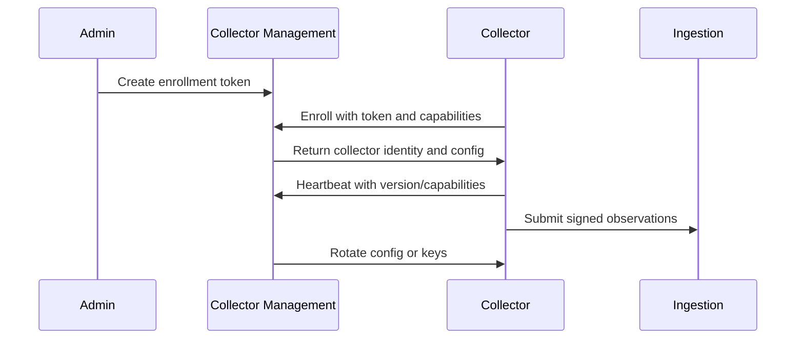

# 10 - Collector Architecture

## Overview

Collectors and connectors are the edge of Visentra discovery. They gather metadata from enterprise surfaces and submit signed observation batches to the ingestion service. Collectors must be safe, auditable, upgradeable, and privacy-aware.

## Collector Types

| Type | Deployment | Primary Sources |
|---|---|---|
| Endpoint Collector | Device agent or managed script. | IDE, local, browser, local LLM, autonomous local jobs. |
| Cloud Connector | SaaS-hosted or customer-managed integration. | AWS, Azure, GCP, managed AI, cloud resources. |
| Container Collector | Cluster agent or API connector. | Kubernetes, ECS, Docker, registries. |
| Repository Connector | API integration or webhook scanner. | GitHub, GitLab, Bitbucket, Azure DevOps. |
| SaaS Connector | Admin API integration. | CRM, ITSM, productivity, AI SaaS. |
| MCP Scanner | Endpoint/repo/cloud scan module. | MCP client configs, servers, tools. |
| Browser Collector | Endpoint/browser management integration. | Extensions and permissions. |

## Collector Lifecycle

## Enrollment Requirements

- Enrollment token is short-lived.
- Collector receives stable `collector_id`.
- Collector receives scoped signing key or certificate.
- Capabilities are reported at enrollment and heartbeat.
- Enrollment event is audited.

## Configuration Model

Collector config includes:

- Tenant ID.
- Source modules enabled.
- Scan interval.
- Data sensitivity settings.
- Redaction rules.
- Endpoint allowlists/denylists.
- Maximum batch size.
- Upload endpoint.
- Logging level.
- Upgrade channel.

## Observation Submission

Collectors submit batches with:

- Signed envelope.
- Idempotency key.
- Payload hash.
- Schema version.
- Source module versions.
- Observation timestamps.
- Compressed payload reference or inline payload within size limits.

## Health Model

| Health Signal | Description |
|---|---|
| Heartbeat | Collector liveness and version. |
| Capability Report | Supported modules and permissions. |
| Last Observation | Freshness of source data. |
| Error Count | Recent collector-side failures. |
| Rejection Rate | Ingestion/normalization rejection rate. |
| Upgrade State | Current and target versions. |

## Endpoint Collector Modules

- IDE scanner.
- Local process scanner.
- Package/config scanner.
- MCP config scanner.
- Browser extension scanner.
- Local LLM scanner.
- Scheduler/autonomous job scanner.

Endpoint modules must default to metadata collection and avoid raw content.

## Cloud Connector Modules

- Account/project/subscription inventory.
- IAM identity inventory.
- Managed AI service scan.
- Serverless/function scan.
- VM/container service scan.
- Tag and owner enrichment.

Cloud connectors should use least-privilege read-only permissions.

## Container Collector Modules

- Kubernetes API discovery.
- Workload metadata.
- Image metadata and digest collection.
- Label/annotation scan.
- Optional SBOM ingestion.
- CI runner scan.

## Upgrade Strategy

- Support stable, beta, and pinned channels.
- Roll upgrades gradually.
- Preserve backward-compatible observation schema for at least one minor release.
- Collector Management tracks version distribution.
- Failed upgrades report health degradation but do not remove inventory.

## Security Requirements

- Collectors never receive broad platform admin credentials unless source requires them and customer grants explicitly.
- Secrets are stored in platform secret management, not in collector logs.
- Observation signing protects integrity.
- Collector identity can be revoked.
- All submissions are tenant-scoped.

## Failure Handling

| Failure | Behavior |
|---|---|
| Network unavailable | Buffer locally within limits and retry. |
| Config invalid | Keep last known good config and report error. |
| Key expired | Request rotation; stop submitting if unauthorized. |
| Source permission denied | Report capability failure. |
| Batch rejected | Retry only if retryable; otherwise record rejection. |

## Related Documents

- [09-discovery-sources.md](./09-discovery-sources.md)
- [17-telemetry-and-events.md](./17-telemetry-and-events.md)
- [19-security-and-access-control.md](./19-security-and-access-control.md)
