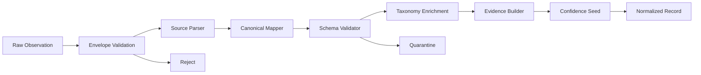

# 11 - Normalization Pipeline

## Overview

The normalization pipeline converts heterogeneous source observations into canonical Visentra records. It preserves evidence, applies source-specific mappings, validates schemas, enriches known taxonomies, seeds confidence, and prepares records for identity resolution and graph construction.

## Pipeline Stages



## Stage Responsibilities

| Stage | Responsibility |
|---|---|
| Envelope Validation | Confirm tenant, source, schema, hash, idempotency, size, and signature. |
| Source Parser | Parse source-specific payloads into typed intermediate records. |
| Canonical Mapper | Map fields to Visentra entities and relationships. |
| Schema Validator | Enforce canonical schema versions and required fields. |
| Taxonomy Enrichment | Recognize providers, frameworks, MCP transports, tool categories, runtimes. |
| Evidence Builder | Create evidence references for every canonical claim. |
| Confidence Seed | Assign initial confidence based on source and signal strength. |

## Normalized Record Types

- Agent candidate.
- Agent instance candidate.
- Device.
- IDE.
- Repository.
- Model.
- Model provider.
- Tool.
- MCP server.
- Cloud account.
- Cloud resource.
- Container workload.
- SaaS app.
- Browser extension.
- Identity.
- Relationship candidate.
- Discovery event.

## Canonical Mapping Rules

- Preserve source-native identifiers.
- Normalize names but keep aliases.
- Use enums for known categories and `unknown` for ambiguous values.
- Do not drop weak signals; mark confidence appropriately.
- Do not invent ownership without evidence.
- Keep sensitive values hashed or redacted according to source policy.

## Evidence Requirements

Every canonical field should be traceable to one or more evidence references:

```json
{
  "evidence_id": "ev_123",
  "source_type": "ide",
  "source_id": "collector_456",
  "observation_id": "obs_789",
  "field_path": "$.extensions[0].id",
  "normalized_field": "agent.source_indicators.ide_extension",
  "value_preview": "publisher.agent-extension",
  "confidence_delta": 25,
  "observed_at": "2026-07-10T11:10:00Z"
}
```

## Quarantine vs Rejection

| Outcome | Meaning | Example |
|---|---|---|
| Reject | Observation cannot be trusted or processed. | Bad signature, missing tenant, invalid envelope. |
| Quarantine | Observation is trusted but mapping/schema failed. | Unknown enum, malformed source payload, unsupported version. |
| Normalize | Record is valid and can proceed. | Valid IDE extension observation. |

## Idempotency

Normalization must be replay-safe:

- Use observation idempotency keys.
- Generate deterministic candidate IDs where possible.
- Avoid duplicate evidence rows.
- Emit normalized records with deterministic hashes.

## Taxonomies

Taxonomies should be versioned:

- Agent frameworks.
- Model providers.
- Model families.
- MCP transports.
- Tool categories.
- Browser permissions.
- Cloud services.
- IDE extensions.
- Local LLM runtimes.

Taxonomy updates should not require collector redeployment when possible.

## Data Quality Events

Normalization emits data quality events for:

- Unknown schema version.
- Missing required field.
- Unsupported source capability.
- Sensitive value redacted.
- Mapping fallback used.
- Record quarantined.
- High rejection rate by connector version.

## Performance Requirements

- Process records in streaming batches.
- Support horizontal scaling by tenant/source partition.
- Publish lag metrics.
- Avoid synchronous graph/search writes in normalization.
- Preserve backpressure through NATS consumer flow control.

## Related Documents

- [05-information-architecture.md](./05-information-architecture.md)
- [12-agent-identity-resolution.md](./12-agent-identity-resolution.md)
- [17-telemetry-and-events.md](./17-telemetry-and-events.md)
