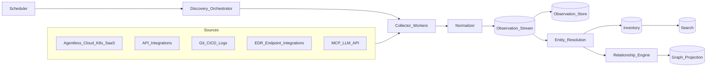
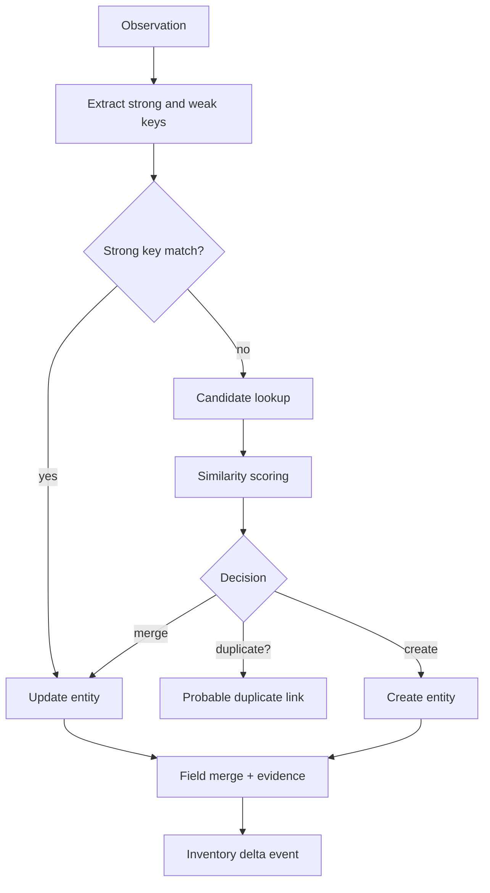

# 12. Discovery Engine

The discovery engine converts signals from cloud APIs, Kubernetes, SaaS, CI/CD, git, logs, identity, MCP/LLM provider APIs, and **optional EDR/endpoint-management integrations** into normalized observations that feed identity resolution, relationship inference, search, dashboards, and realtime UI. See [27-discovery-workflow.md](./27-discovery-workflow.md) for the end-to-end workflow.

**Platform posture: agentless.** Visentra does not require a proprietary client on endpoints. Endpoint/IDE/process evidence is obtained by integrating with the customer’s existing EDR (or similar) systems when that coverage is needed.

Related: [11-apis.md](./11-apis.md), [13-visibility-engine.md](./13-visibility-engine.md), [14-relationship-engine.md](./14-relationship-engine.md), [26-data-flow-diagrams.md](./26-data-flow-diagrams.md).

## Architecture



## Collector catalog

| Collector | Mode | Entities | Evidence |
|---|---|---|---|
| Agentless | Remote / API | Hosts, workloads, cloud AI resources | Cloud/K8s metadata, tags, resource IDs. |
| API | SaaS/internal API poller | Apps, users, API keys, agents | Provider object IDs, owners, timestamps. |
| Cloud API | AWS/Azure/GCP inventory | Compute, functions, managed AI, IAM, DBs | ARN/resource ID, tags, policies, network metadata. |
| EDR integration | Pull from CrowdStrike / Defender / Cortex / Intune / Netskope etc. | Devices, processes, IDE agents, local LLM runtimes | Process cmdline, detected apps, device owner, last seen. |
| Runtime | Traces/logs (OTLP, APM) | Agents, tools, model calls | Trace span, tool name, model parameters. |
| Network | Flow/DNS/SNI (via existing sensors) | External APIs, model hosts, MCP endpoints | Host, IP, port, protocol, correlation IDs. |
| Log | SIEM / log query | Agents, tools, errors, model usage | Parsed fields, trace IDs, source stream. |
| Container | Registry/runtime API | Images, packages, entrypoints | Digest, labels, SBOM, command. |
| K8s | API/watch | Clusters, namespaces, workloads, pods | Owner refs, labels, images, service accounts. |
| Git | SCM API/webhook | Repos, prompts, frameworks, code agents | Commit SHA, path, CODEOWNERS, AST matches. |
| CI/CD | Pipeline API | Build agents, scheduled agents | Job defs, secrets refs (names only), runners. |
| MCP / LLM API | Provider + config APIs | MCP servers, models, usage | Server URL, tool list, model IDs (no raw secrets). |

**Explicitly out of default scope:** deploying a Visentra daemon, IDE plugin, or filesystem agent on employee laptops. Those signals come from **EDR / MDM / existing endpoint tooling** when the customer enables that connector.
| CI/CD | Pipeline events | Builds, artifacts, deployments | Run ID, actor, image digest, target env. |
| MCP | Protocol/config discovery | MCP servers, tools, resources | Server URL/command, tool schema, client config. |
| LLM API | Provider telemetry | Models, deployments, usage | Model name, key alias, client library, caller metadata. |

## Collector contract

```typescript
interface Collector {
  kind: string;
  version: string;
  validateConfig(config: CollectorConfig): ValidationResult;
  plan(scope: DiscoveryScope, cursor?: CollectorCursor): Promise<ScanPlan>;
  collect(task: CollectorTask, emit: ObservationEmitter): Promise<CollectorResult>;
  health(config: CollectorConfig): Promise<CollectorHealth>;
}
```

| Output | Requirement |
|---|---|
| Observations | Immutable normalized envelopes with tenant, collector, timestamp, entity hint, identity keys, attributes, relationships. |
| Cursor | Opaque continuation token scoped to connector and scope hash. |
| Tombstone | Emitted when a previously observed external object disappears. |
| Metrics | Scanned, emitted, skipped, throttled, failed, retried. |
| Checkpoints | Persisted for large scans so retries resume safely. |

## Observation model

```json
{
  "id": "obs_01jzw91t0cdy51kjewg8g8j77h",
  "tenantId": "ten_acme",
  "jobId": "job_01jzw8kecvf9y7yrn8s67c7qf7",
  "collector": {"kind": "kubernetes", "version": "1.4.0", "connectorId": "conn_k8s_prod"},
  "observedAt": "2026-07-10T11:12:44Z",
  "entityHint": {"type": "agent", "externalId": "k8s://prod/legal-ai/deployment/contract-review-copilot", "name": "contract-review-copilot"},
  "identity": {
    "strongKeys": ["k8s:prod:legal-ai:deployment:contract-review-copilot"],
    "weakKeys": ["repo:acme/legal-ai-services:path:services/contract-review", "image:sha256:4f5c"]
  },
  "attributes": {"framework": "langchain", "language": "python", "image": "ghcr.io/acme/legal-ai@sha256:4f5c"},
  "relationships": [
    {"type": "RUNS_IN", "targetHint": {"type": "kubernetes_namespace", "externalId": "k8s://prod/legal-ai"}, "confidence": 0.99}
  ],
  "sourceHash": "sha256:be1a819c",
  "visibility": "metadata_only"
}
```

## Scheduling

| Schedule | Use |
|---|---|
| Fixed interval | Cloud API, API, log, LLM usage polling. |
| Watch/webhook | K8s watch, Git push, registry push, CI completed. |
| Adaptive | High-change scopes, coverage gaps, recent failures. |
| Manual | Operator launches scoped scan through `/api/v1/discovery/jobs`. |
| Backfill | New collector or schema version requires replay/rescan. |

Scheduler priority score:

```text
priority = overdueWeight + manualWeight + coverageGapWeight + changeRateWeight - failureBackoff
```

## Confidence scoring

| Evidence | Base score |
|---|---:|
| Strong provider ID | 0.95 |
| Runtime trace/model call | 0.90 |
| K8s owner reference | 0.88 |
| CI image digest tied to deployment | 0.86 |
| Source framework import and agent manifest | 0.82 |
| IDE workspace config | 0.72 |
| Log pattern with trace correlation | 0.70 |
| Network host only | 0.55 |
| Name similarity only | 0.30 |

Combined score:

```text
combined = 1 - product(1 - evidenceScore[i] * sourceReliability[i] * freshness[i])
freshness = exp(-ageHours / halfLifeHours)
```

## Entity resolution and deduplication



| Decision | Threshold | Rule |
|---|---:|---|
| Auto-merge strong key | 0.92 | No immutable conflict. |
| Auto-merge weak keys | 0.87 | At least two independent evidence classes. |
| Probable duplicate | 0.72 | Keep separate, link candidates. |
| Separate | < 0.72 | Create or retain independent entity. |

## Implementation checklist

- Implement collector SDK with redaction, retry, cursor, checkpoint, and schema validation helpers.
- Store `observations`, `collector_runs`, `collector_cursors`, `resolution_decisions`, and `normalization_rejections`.
- Partition queues by tenant, connector, collector kind, and priority.
- Make observation consumers idempotent by observation ID and source hash.
- Emit job, inventory, and graph events consumed by [13-visibility-engine.md](./13-visibility-engine.md).
