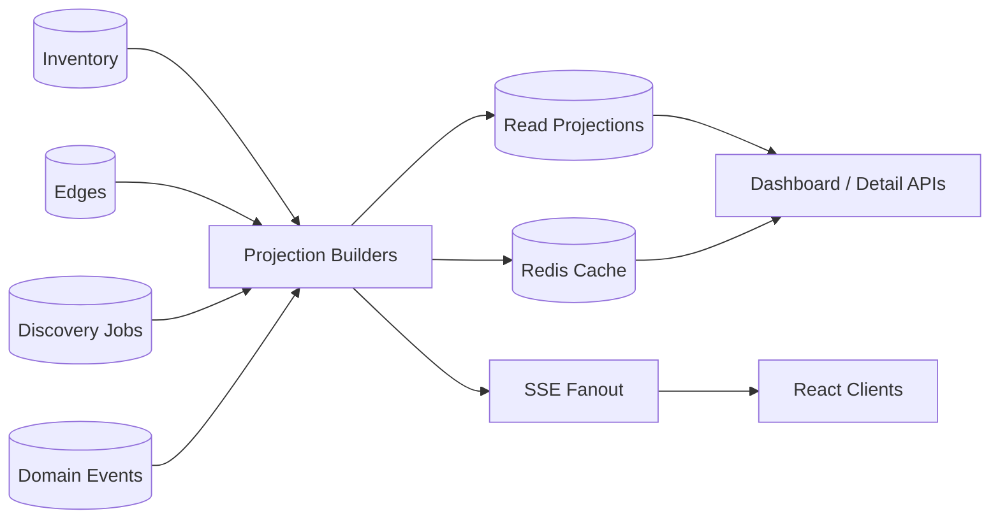

# 13. Visibility Engine

The visibility engine builds read-optimized projections and realtime updates from inventory, discovery, relationship, search, and coverage events. It keeps dashboards and detail pages responsive without forcing UI requests to join raw observations and graph evidence directly.

Related: [12-discovery-engine.md](./12-discovery-engine.md), [14-relationship-engine.md](./14-relationship-engine.md), [17-frontend-components.md](./17-frontend-components.md), [26-data-flow-diagrams.md](./26-data-flow-diagrams.md).

## Architecture



## Projection catalog

| Projection | Purpose | Refresh | Storage |
|---|---|---|---|
| `agent_summary_projection` | Agent list, cards, dashboard counts | Event-driven + reconciliation | PostgreSQL/materialized view |
| `agent_detail_projection` | Detail page fast load | Event-driven, lazy hydrate | PostgreSQL JSONB/Redis |
| `asset_summary_projection` | Asset list and used-by counts | Event-driven | PostgreSQL |
| `relationship_summary_projection` | Direct dependency panels | Edge events | PostgreSQL |
| `coverage_scope_projection` | Coverage map and gap table | Scheduled + job events | PostgreSQL |
| `discovery_job_projection` | Job monitor | Job/task events | PostgreSQL/Redis |
| `dashboard_rollup_hourly` | Trend charts | Streaming aggregate | PostgreSQL/OLAP |

## Agent summary shape

```json
{
  "agentId": "agt_contract_review",
  "tenantId": "ten_acme",
  "name": "contract-review-copilot",
  "status": "active",
  "ownerId": "grp_platform_ai",
  "department": "Legal Technology",
  "businessUnit": "Corporate",
  "framework": "langchain",
  "language": "python",
  "runtimeKind": "kubernetes",
  "repo": "acme/legal-ai-services",
  "models": ["gpt-4.1"],
  "toolsCount": 12,
  "mcpServersCount": 1,
  "externalApisCount": 3,
  "confidence": 0.94,
  "riskLevel": "high",
  "lastObservedAt": "2026-07-10T11:06:44Z"
}
```

## Realtime SSE

Endpoint:

```http
GET /api/v1/discovery/events/stream?topics=jobs,inventory,graph,coverage
Accept: text/event-stream
```

| Event | Use |
|---|---|
| `heartbeat` | Keep connection alive; detect reconnect. |
| `discovery.job.started` | Add job to monitor. |
| `discovery.job.progress` | Patch progress counters. |
| `discovery.job.completed` | Mark job complete; refresh dashboards. |
| `inventory.agent.created` | Add new agent row/card. |
| `inventory.agent.updated` | Patch visible agent detail/list. |
| `graph.edge.created` | Update graph if endpoint visible. |
| `coverage.updated` | Refresh coverage tile/map node. |

Example:

```text
event: inventory.agent.updated
id: evt_01jzw9vhzj0g1gff0c0jbe4j4x
retry: 5000
data: {"tenantId":"ten_acme","agentId":"agt_contract_review","changed":["models","lastObservedAt"],"version":44}
```

## Coverage maps

Coverage compares expected scope to recently observed evidence.

| Dimension | Numerator | Denominator |
|---|---|---|
| Source configured | Enabled collectors | Expected collectors in tenant onboarding plan. |
| Scope scanned | Successful partitions | Enabled partitions. |
| Runtime visibility | Workloads with runtime/process evidence | Workloads from cloud/K8s inventory. |
| Source visibility | Recently scanned repos | Repos in connected SCM orgs. |
| LLM visibility | Provider usage records observed | Known key aliases/gateway/provider exports. |
| MCP visibility | MCP configs and introspected servers | Expected IDE/repo/container MCP surfaces. |

Gap taxonomy:

| Gap | Meaning |
|---|---|
| `connector_missing` | Expected source has no connector. |
| `permission_denied` | Connector lacks read permissions. |
| `stale_cursor` | Incremental cursor stopped advancing. |
| `scan_failed` | Last scan failed. |
| `identity_unresolved` | Observations exist but cannot be merged. |

Coverage projection example:

```json
{
  "scopeId": "scope_aws_prod_use1",
  "source": "cloud_api",
  "scopeType": "cloud_account_region",
  "displayName": "AWS 123456789012 / us-east-1",
  "expectedTargets": 1280,
  "freshTargets": 1184,
  "coverageRatio": 0.925,
  "lastSuccessfulScanAt": "2026-07-10T10:55:00Z",
  "gaps": [{"type": "permission_denied", "count": 11}]
}
```

## Dashboard aggregation

| Dashboard | Widgets | Inputs |
|---|---|---|
| Overview | total agents, active/stale, model usage, framework distribution, coverage score | Agent, edge, coverage projections. |
| Activity | new entities, changed relationships, stale entities, recent jobs | Domain events and job projection. |
| Relationships | top connected agents, MCP usage, external connectivity, data dependencies | Graph/edge projections. |
| Search analytics | top queries, facet usage, zero-result terms | Search telemetry. |

Rollup windows:

| Window | Retention | Use |
|---|---:|---|
| 1 minute | 24 hours | Live activity/job charts. |
| 1 hour | 180 days | Dashboard trend charts. |
| 1 day | 2 years | Long-term coverage/adoption trends. |

## Consistency targets

| View | Target |
|---|---:|
| Discovery job monitor | < 2 seconds from event publish. |
| Agent list | < 10 seconds from resolution. |
| Graph expand | < 15 seconds from edge inference. |
| Search | < 30 seconds from projection update. |
| Dashboard rollups | < 60 seconds. |

## Implementation checklist

- Implement idempotent projection handlers keyed by event ID and entity version.
- Store active projection version so full rebuilds can swap atomically.
- Use Redis for short-lived dashboard cache and SSE replay.
- Add drift checks comparing projections to canonical inventory and edge counts.
- Add tenant-scoped SSE authorization and `Last-Event-ID` replay.
