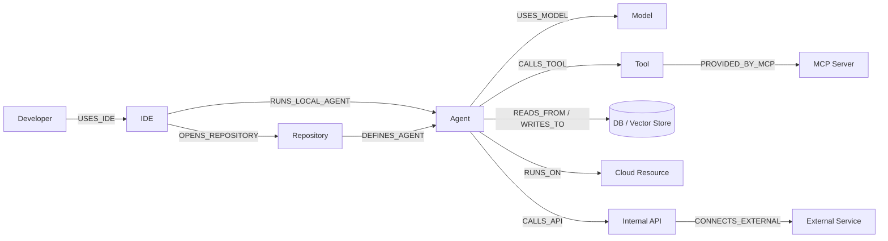
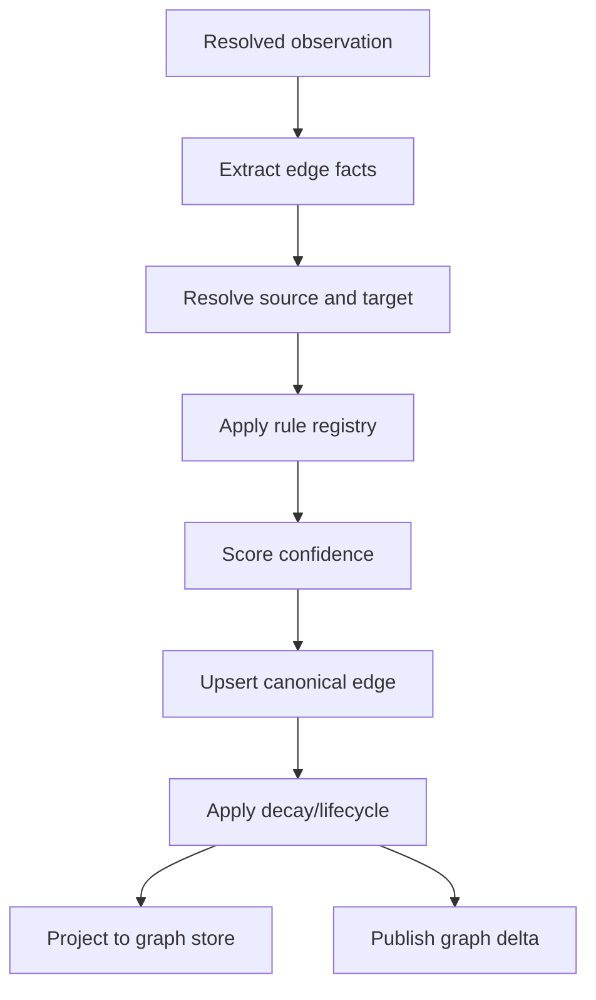

# 14. Relationship Engine

The relationship engine infers, scores, decays, stores, and projects edges between Visentra entities. It explains how developers, IDEs, agents, models, tools, MCP servers, data stores, cloud resources, APIs, and external services connect.

Related: [12-discovery-engine.md](./12-discovery-engine.md), [13-visibility-engine.md](./13-visibility-engine.md), [15-search-architecture.md](./15-search-architecture.md), [25-sequence-diagrams.md](./25-sequence-diagrams.md).

## Target chain



## Edge catalog

| Edge | From | To | Evidence |
|---|---|---|---|
| `USES_IDE` | Developer | IDE | IDE plugin session/user. |
| `OPENS_REPOSITORY` | IDE | Repository | Workspace path and SCM remote. |
| `RUNS_LOCAL_AGENT` | IDE | Agent | Launch config, process tree, framework event. |
| `OWNS` | User/Group | Agent/Asset | CODEOWNERS, tags, IdP group, manual owner. |
| `DEFINES_AGENT` | Repository | Agent | Source framework, manifest, deployment config. |
| `BUILDS_IMAGE` | CI pipeline | Container image | Build run, digest, provenance. |
| `DEPLOYS` | CI pipeline | Runtime workload | Deployment event, GitOps commit, cluster state. |
| `RUNS_AS` | Agent | Process/container/workload | Runtime, process, K8s evidence. |
| `RUNS_ON` | Runtime | Host/cluster/cloud | Node, hostname, instance/resource ID. |
| `USES_MODEL` | Agent | Model | Runtime span, provider telemetry, source literal. |
| `CALLS_TOOL` | Agent | Tool | Tool-call span, MCP schema, framework registration. |
| `PROVIDED_BY_MCP` | Tool | MCP server | MCP introspection/config/process. |
| `USES_PROMPT` | Agent | Prompt | Template path, prompt ID, trace metadata. |
| `READS_FROM` | Agent/tool | DB/bucket/queue/API | Client config, IAM, logs, runtime call. |
| `WRITES_TO` | Agent/tool | DB/bucket/queue/API | Runtime operation, logs, SDK call. |
| `CALLS_API` | Agent/tool | API | HTTP trace, gateway logs, source URL. |
| `CONNECTS_EXTERNAL` | Agent/tool/API | External service | DNS/SNI, egress logs, provider endpoint. |

## Inference pipeline



## Inference rules

| Relationship | High-confidence rule | Lower-confidence rule |
|---|---|---|
| Developer -> IDE | Plugin authenticates user and emits signed heartbeat. | SCM author resembles workstation user. |
| IDE -> Agent | Local process collector links IDE parent to agent process. | Workspace contains agent framework files. |
| Repository -> Agent | Deployment manifest maps repo path/image digest to runtime agent. | Framework imports and tool/prompt declarations. |
| Agent -> Model | Runtime LLM span includes agent and model. | Source contains model literal. |
| Agent -> Tool | Runtime tool-call span names tool schema. | Source registers function as tool. |
| Tool -> MCP | MCP introspection returns server/tool schema. | MCP config file maps command/URL. |
| Agent -> DB/API | Trace/log contains resource and operation. | Env var/secret name hints at resource. |
| Agent -> Cloud | K8s workload identity maps workload to cloud role. | Cloud tags match agent name. |

## Confidence and decay

```text
evidenceScore = 1 - product(1 - ruleScore[i] * sourceReliability[i])
diversityBoost = min(0.08, 0.02 * (sourceDiversity - 1))
freshness = exp(-ageHours / edgeHalfLifeHours)
confidence = min(0.99, (evidenceScore + diversityBoost) * freshness)
```

| Edge class | Half-life |
|---|---:|
| Runtime calls | 72 hours |
| Network-only flows | 48 hours |
| Workload placement | 168 hours |
| MCP introspection | 168 hours |
| Source definitions | 720 hours |
| Ownership | 2160 hours |

| State | Criteria |
|---|---|
| `active` | Confidence >= 0.70 and no tombstone. |
| `probable` | Confidence 0.50-0.69. |
| `stale` | Decayed below active threshold or source TTL exceeded. |
| `tombstoned` | Strong removal evidence. |
| `conflicted` | Evidence contradicts immutable endpoints. |

## Edge storage

| Column | Notes |
|---|---|
| `id`, `tenant_id` | Stable edge ID and tenant partition. |
| `source_entity_id`, `target_entity_id`, `edge_type` | Canonical endpoints and type. |
| `confidence`, `base_confidence`, `state` | Current score, pre-decay score, lifecycle. |
| `first_observed_at`, `last_observed_at`, `valid_from`, `valid_to` | Temporal model. |
| `evidence_summary` | Source kinds, rule IDs, counts. |

`edge_evidence` maps canonical edges to observation IDs and rule IDs.

## Neo4j projection

Neo4j is an optional traversal projection. PostgreSQL canonical edges remain the source of truth unless a deployment explicitly chooses graph-native storage.

Labels: `Developer`, `IDE`, `Repository`, `Agent`, `Model`, `Tool`, `MCPServer`, `DataStore`, `CloudResource`, `API`, `ExternalService`.

Relationship properties:

```cypher
{
  edgeId: "edge_77bc",
  tenantId: "ten_acme",
  confidence: 0.91,
  state: "active",
  evidenceCount: 4,
  sources: ["runtime", "llm_api"],
  firstObservedAt: datetime("2026-06-02T15:44:12Z"),
  lastObservedAt: datetime("2026-07-10T10:59:20Z")
}
```

Upsert pattern:

```cypher
MERGE (a:Agent {id: $sourceId, tenantId: $tenantId})
MERGE (m:Model {id: $targetId, tenantId: $tenantId})
MERGE (a)-[r:USES_MODEL {edgeId: $edgeId}]->(m)
SET r.confidence = $confidence,
    r.state = $state,
    r.evidenceCount = $evidenceCount,
    r.sources = $sources,
    r.lastObservedAt = datetime($lastObservedAt)
```

## Implementation checklist

- Implement versioned rule registry with deterministic rule IDs.
- Store edge facts separately from canonical edges for replay.
- Make upserts idempotent by `(tenant, source, target, edgeType, observationId, ruleId)`.
- Run scheduled decay and emit stale/tombstone events.
- Provide graph projection adapters for PostgreSQL, Neo4j, Neptune, and Cosmos Gremlin.
- Index relationship facets for [15-search-architecture.md](./15-search-architecture.md).
