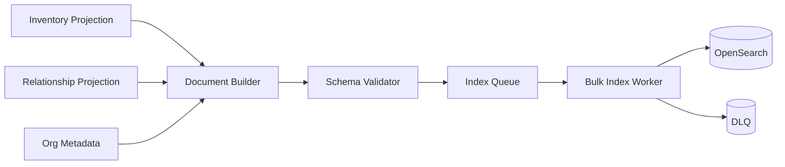

# 15. Search Architecture

Visentra search uses OpenSearch as the reference engine for full-text discovery, exact filters, facets, autocomplete, highlighting, and relationship-aware ranking across agents, assets, prompts, tools, MCP servers, repositories, observations, and graph edges.

Related: [11-apis.md](./11-apis.md), [13-visibility-engine.md](./13-visibility-engine.md), [14-relationship-engine.md](./14-relationship-engine.md), [16-backend-services.md](./16-backend-services.md).

## Index topology

| Alias | Backing index pattern | Documents |
|---|---|---|
| `agentradar-agents-read/write` | `agentradar-agents-v{n}` | Agent search cards and detail summaries. |
| `agentradar-assets-read/write` | `agentradar-assets-v{n}` | Models, tools, MCP, repos, DBs, APIs, cloud resources. |
| `agentradar-prompts-read/write` | `agentradar-prompts-v{n}` | Prompt metadata and permitted summaries/hashes. |
| `agentradar-relationships-read/write` | `agentradar-relationships-v{n}` | Flattened edge docs. |
| `agentradar-observations-read/write` | `agentradar-observations-v{n}` | Metadata-only evidence records. |
| `agentradar-suggest-read/write` | `agentradar-suggest-v{n}` | Completion terms. |

Use versioned backing indices and alias swaps for mapping changes.

## Required facets

| Facet | Field | Source |
|---|---|---|
| Owner | `owner.id`, `owner.name.keyword` | IdP, CODEOWNERS, tags, manual metadata. |
| Model | `model` | `USES_MODEL` edges and model observations. |
| Framework | `framework` | Source/runtime framework detection. |
| Cloud | `cloud` | Runtime/cloud resource projection. |
| Repo | `repo` | Git/CI/deployment metadata. |
| Tool | `tool` | `CALLS_TOOL` and MCP tool schema. |
| Prompt | `prompt` | Prompt metadata/path/hash. |
| Language | `language` | Source/package/runtime detection. |
| Department | `department` | Owner/org metadata. |
| Risk | `risk` | Inventory projection risk field. |
| Hostname | `hostname` | Host/node/pod runtime metadata. |
| Project | `project` | Tags, repo metadata, CMDB/app catalog. |
| BU | `businessUnit` | Owner/org metadata. |

## Agent document

```json
{
  "id": "agt_contract_review",
  "tenantId": "ten_acme",
  "docType": "agent",
  "title": "contract-review-copilot",
  "summary": "Assists legal operations with contract clause review.",
  "content": "contract review legal ai langchain python gpt-4.1 jira s3",
  "owner": {"id": "grp_platform_ai", "name": "Platform AI"},
  "department": "Legal Technology",
  "businessUnit": "Corporate",
  "project": "contract-automation",
  "model": ["gpt-4.1"],
  "framework": "langchain",
  "cloud": "aws",
  "repo": ["acme/legal-ai-services"],
  "tool": ["jira_create_issue", "s3_get_object"],
  "prompt": ["contract_review_system_prompt"],
  "language": "python",
  "risk": "high",
  "hostname": ["ip-10-4-12-91"],
  "confidence": 0.94,
  "graphDegree": 47,
  "lastObservedAt": "2026-07-10T11:06:44Z"
}
```

## Mapping excerpt

```json
{
  "mappings": {
    "dynamic": "strict",
    "properties": {
      "tenantId": {"type": "keyword"},
      "docType": {"type": "keyword"},
      "title": {
        "type": "text",
        "analyzer": "agentradar_text",
        "fields": {
          "keyword": {"type": "keyword", "ignore_above": 256},
          "suggest": {"type": "completion"}
        }
      },
      "content": {"type": "text", "analyzer": "agentradar_text"},
      "owner.id": {"type": "keyword"},
      "owner.name.keyword": {"type": "keyword"},
      "model": {"type": "keyword"},
      "framework": {"type": "keyword"},
      "cloud": {"type": "keyword"},
      "repo": {"type": "keyword"},
      "tool": {"type": "keyword"},
      "prompt": {"type": "keyword"},
      "language": {"type": "keyword"},
      "department": {"type": "keyword"},
      "risk": {"type": "keyword"},
      "hostname": {"type": "keyword"},
      "project": {"type": "keyword"},
      "businessUnit": {"type": "keyword"},
      "confidence": {"type": "float"},
      "graphDegree": {"type": "integer"},
      "lastObservedAt": {"type": "date"}
    }
  }
}
```

## Query construction

```json
{
  "query": {
    "bool": {
      "filter": [
        {"term": {"tenantId": "ten_acme"}},
        {"terms": {"docType": ["agent", "asset", "prompt"]}},
        {"terms": {"risk": ["high", "medium"]}},
        {"terms": {"model": ["gpt-4.1"]}}
      ],
      "must": [
        {
          "multi_match": {
            "query": "invoice extraction",
            "fields": ["title^5", "summary^3", "content", "repo^2", "tool^2", "prompt^2"],
            "operator": "and"
          }
        }
      ]
    }
  },
  "aggs": {
    "owner": {"terms": {"field": "owner.id", "size": 50}},
    "model": {"terms": {"field": "model", "size": 50}},
    "framework": {"terms": {"field": "framework", "size": 50}},
    "cloud": {"terms": {"field": "cloud", "size": 20}},
    "repo": {"terms": {"field": "repo", "size": 50}},
    "tool": {"terms": {"field": "tool", "size": 50}},
    "prompt": {"terms": {"field": "prompt", "size": 50}},
    "language": {"terms": {"field": "language", "size": 50}},
    "department": {"terms": {"field": "department", "size": 50}},
    "risk": {"terms": {"field": "risk", "size": 10}},
    "hostname": {"terms": {"field": "hostname", "size": 50}},
    "project": {"terms": {"field": "project", "size": 50}},
    "businessUnit": {"terms": {"field": "businessUnit", "size": 50}}
  }
}
```

## Relevance

```text
finalScore = textScore
  + 0.4 * confidence
  + 0.2 * recencyBoost(lastObservedAt)
  + 0.1 * log(1 + graphDegree)
  + exactMatchBoost
```

| Exact match | Boost |
|---|---:|
| Agent/model/tool name | 8 |
| Repository slug | 6 |
| Hostname | 5 |
| Owner/project/BU | 4 |
| Prompt ID/path | 4 |

## Ingestion flow



## Controls

| Control | Implementation |
|---|---|
| Tenant isolation | API always applies `tenantId` filter; documents require `tenantId`. |
| Payload safety | Do not index secrets, raw credentials, or raw prompt bodies by default. |
| Idempotency | Document ID equals canonical entity/edge/prompt ID. |
| Ordering | Include entity version; ignore stale update messages. |
| Rebuild | Full reindex from projections with alias swap. |

## Implementation checklist

- Implement strict mappings and document-builder tests.
- Add OpenSearch bulk indexer with retry and DLQ.
- Add facet contract tests for every required facet.
- Add full reindex workflow and alias-swap validation.
- Add relevance golden tests for common enterprise queries.
