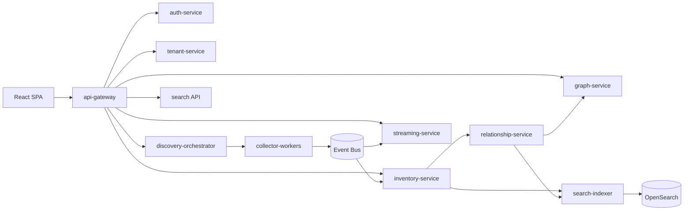

# 16. Backend Services

Visentra can start as a modular monolith and evolve into independently scalable services. The target service catalog below defines boundaries that should be preserved in code packages even when deployed together.

Related: [11-apis.md](./11-apis.md), [12-discovery-engine.md](./12-discovery-engine.md), [18-deployment-architecture.md](./18-deployment-architecture.md), [19-kubernetes-deployment.md](./19-kubernetes-deployment.md).

## Service dependency map



## Microservice catalog

| Service | Responsibilities | Storage | Scales by |
|---|---|---|---|
| `api-gateway` | REST routing, auth validation, tenant context, rate limits, response shaping. | Redis for rate/session state. | Request rate, latency, CPU. |
| `inventory-service` | Canonical agents/assets, observations, field evidence, owner/tag metadata. | PostgreSQL, optional object storage. | API load, queue lag, DB pool. |
| `discovery-orchestrator` | Connector config, scheduling, job lifecycle, task leases, cursors. | PostgreSQL, queue. | Scheduled lag, task queue depth. |
| `collector-workers` | Execute collectors and emit observations. | Local temp/checkpoint only. | Queue depth by collector kind. |
| `relationship-service` | Edge facts, inference rules, confidence, decay, graph delta events. | PostgreSQL edge/evidence tables. | Edge queue lag, CPU. |
| `graph-service` | Neighborhood/path APIs and traversal templates. | Neo4j/Neptune/Cosmos/PostgreSQL projection. | Graph query latency. |
| `search-indexer` | Build and bulk index OpenSearch documents; reindex. | OpenSearch, offset table. | Index queue lag. |
| `streaming-service` | SSE auth, topic authorization, replay, fanout. | Redis streams/message bus. | Active connections. |
| `auth-service` | Local auth, OIDC/SAML, token/session lifecycle. | PostgreSQL, Redis, secret manager. | Auth request rate. |
| `tenant-service` | Tenant catalog, memberships, settings, connector policy defaults. | PostgreSQL. | Request rate/cache misses. |

## Event contracts

```json
{
  "eventId": "evt_01jzwa4hbn48ntw0syyhx5fazf",
  "eventType": "inventory.entity.updated",
  "tenantId": "ten_acme",
  "occurredAt": "2026-07-10T11:20:00Z",
  "producer": "inventory-service",
  "schemaVersion": "1.0",
  "subject": {"type": "agent", "id": "agt_contract_review", "version": 45},
  "data": {"changed": ["models", "lastObservedAt"]}
}
```

| Event | Producer | Consumers |
|---|---|---|
| `observation.normalized` | Collector workers | Inventory, relationship. |
| `inventory.entity.created` | Inventory | Visibility, relationship, search, streaming. |
| `inventory.entity.updated` | Inventory | Visibility, relationship, search, streaming. |
| `graph.edge.created` | Relationship | Graph, visibility, search, streaming. |
| `discovery.job.progress` | Orchestrator | Visibility, streaming. |
| `search.document.indexed` | Search indexer | Operations/visibility. |

## Data ownership

| Data | Owner |
|---|---|
| Users, identities, sessions | `auth-service` |
| Tenants, memberships, settings | `tenant-service` |
| Connectors, jobs, cursors | `discovery-orchestrator` |
| Observations, agents, assets | `inventory-service` |
| Edge facts, canonical edges, evidence | `relationship-service` |
| Graph traversal projection | `graph-service` |
| Search indices | `search-indexer` |
| SSE replay window | `streaming-service` |

## Deployment modes

| Mode | Composition | Use |
|---|---|---|
| Modular monolith | Gateway/auth/tenant/inventory/discovery API in one process; workers separate. | Small BYOC. |
| Service bundle | Gateway/auth/tenant/inventory together; discovery, relationship, search, streaming separate. | Medium enterprise. |
| Full microservices | All services independently deployed. | SaaS and high-volume BYOC. |

## Resilience patterns

| Pattern | Use |
|---|---|
| Outbox table | Inventory and relationship events. |
| Idempotency keys | Job launch, export, connector create, action retry. |
| Queue leases | Discovery tasks, index jobs, export jobs. |
| Bulkheads | Separate collector worker pools per source class. |
| Circuit breakers | Provider APIs and downstream service calls. |
| DLQ | Normalization rejects, task failures, index failures. |
| Reconciliation | Projection drift, stale search index, graph rebuild. |

## Service SLOs

| Service | Target |
|---|---|
| `api-gateway` | 99.9% availability; p95 cached/dashboard reads < 300 ms. |
| `inventory-service` | p95 entity detail < 200 ms; projection freshness < 10 s. |
| `discovery-orchestrator` | 99% scheduled jobs start within 5 minutes. |
| `relationship-service` | 95% edge updates projected within 15 seconds. |
| `search-indexer` | 95% documents indexed within 30 seconds. |
| `streaming-service` | p95 event delivery < 2 seconds. |

## Implementation checklist

- Define service packages and interfaces before physical split.
- Add shared event envelope library.
- Use tenant context middleware in every service.
- Add service-to-service auth for full microservice mode.
- Implement `/healthz`, `/readyz`, `/metrics` everywhere.
- Add outbox, retry, and DLQ framework before high-volume rollout.
