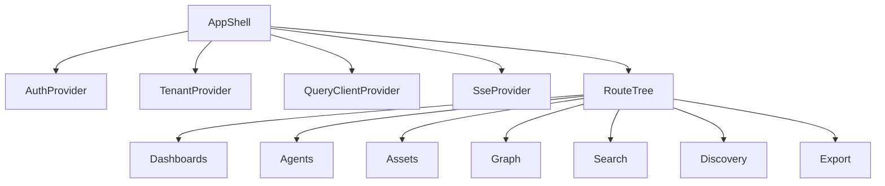

# 17. Frontend Components

AgentRadar's frontend is a React SPA organized by feature domains: dashboards, agents, assets, graph, search, discovery, coverage, exports, and settings. Component responsibilities align with APIs in [11-apis.md](./11-apis.md) and wireframes in [28-ui-wireframes.md](./28-ui-wireframes.md).

Related: [13-visibility-engine.md](./13-visibility-engine.md), [15-search-architecture.md](./15-search-architecture.md), [25-sequence-diagrams.md](./25-sequence-diagrams.md).

## Application structure

## Shell and providers

| Component/hook | Purpose |
|---|---|
| `AppShell` | Layout, navigation, tenant switcher, global search, notifications. |
| `AuthProvider` | Loads `/auth/me`, exposes user, roles, permissions, login/logout. |
| `TenantProvider` | Selected tenant, `X-Tenant-Id`, membership validation. |
| `ApiClientProvider` | Fetch wrapper, request IDs, normalized API errors. |
| `SseProvider` | Connects to SSE, dispatches cache invalidation and notifications. |
| `PermissionGuard` | Conditionally renders actions based on permission matrix. |

## Primary screens

| Route | Page component | Key child components |
|---|---|---|
| `/dashboard` | `OverviewDashboardPage` | `MetricCardGrid`, `ModelUsageChart`, `FrameworkDistributionChart`, `DiscoveryHealthPanel`, `RecentChangesFeed`. |
| `/agents` | `AgentsPage` | `AgentFilterBar`, `AgentTable`, `AgentCardGrid`, `ConfidenceMeter`, `RiskBadge`, `AgentBulkActionsBar`. |
| `/agents/:agentId` | `AgentDetailPage` | `AgentHeader`, `AgentSummaryPanel`, `ModelDependenciesPanel`, `ToolDependenciesPanel`, `DataDependenciesPanel`, `RuntimePanel`, `ObservationEvidenceTable`, `AgentTimeline`. |
| `/assets` | `AssetsPage` | `AssetTypeTabs`, `AssetFilterBar`, `AssetTable`. |
| `/assets/:assetId` | `AssetDetailPage` | `UsedByAgentsPanel`, `AssetObservationPanel`, `RelationshipMiniGraph`. |
| `/graph` | `GraphExplorerPage` | `GraphSearchSeedPicker`, `GraphCanvas`, `GraphControls`, `GraphLegend`, `GraphNodeInspector`, `GraphEdgeInspector`, `PathFinderPanel`. |
| `/search` | `SearchPage` | `SearchInputPanel`, `FacetSidebar`, `SearchResultsList`, `SearchResultCard`, `SavedSearchDialog`. |
| `/discovery` | `DiscoveryPage` | `ConnectorGrid`, `ConnectorCard`, `DiscoveryJobLauncher`, `DiscoveryJobsTable`. |
| `/discovery/jobs/:jobId` | `DiscoveryJobDetailPage` | `JobProgressTimeline`, `CollectorTaskTable`, `ObservationCounterPanel`. |
| `/coverage` | `CoveragePage` | `CoverageMap`, `CoverageGapTable`, `CoverageSourceTabs`, `CoverageTrendChart`. |
| `/exports` | `ExportsPage` | `ExportCreateDialog`, `ExportJobsTable`, `ExportScheduleForm`. |
| `/settings/*` | Settings pages | `UserManagementPage`, `TenantSettingsPage`, `AuthSettingsPage`, `ApiKeysPage`. |

## Shared primitives

| Component | Requirement |
|---|---|
| `DataTable` | Sorting, cursor pagination, selection, column visibility. |
| `FacetMultiSelect` | Searchable values with counts and applied state. |
| `DateRangePicker` | Relative and absolute time windows. |
| `StatusBadge` | Consistent active/stale/running/failed states. |
| `RiskBadge` | Display risk enum without relying only on color. |
| `ConfidenceMeter` | Percent plus source/evidence tooltip. |
| `JsonCodeBlock` | Safe pretty JSON with copy action. |
| `ErrorState` | Safe API error message and request ID. |
| `EmptyState` | Guided next steps for no data/no results. |
| `Drawer` | Inspectors for graph nodes, edges, and details. |

## Data hooks

| Hook | API |
|---|---|
| `useAgentsQuery` | `GET /api/v1/agents` |
| `useAgentDetail` | `GET /api/v1/agents/{agentId}` |
| `useAgentRelationships` | `GET /api/v1/agents/{agentId}/relationships` |
| `useAgentObservations` | `GET /api/v1/agents/{agentId}/observations` |
| `useAssetsQuery` | `GET /api/v1/assets` |
| `useGraphNeighborhood` | `GET /api/v1/graph/neighborhood` |
| `useSearchQuery` | `POST /api/v1/search/query` |
| `useDiscoveryJobs` | `GET /api/v1/discovery/jobs` |
| `useDiscoveryJob` | `GET /api/v1/discovery/jobs/{jobId}` |
| `useDashboardOverview` | `GET /api/v1/dashboards/overview` |
| `useCoverage` | `GET /api/v1/dashboards/coverage` |
| `useExportJobs` | `GET /api/v1/export/jobs` |

## Realtime cache behavior

| SSE event | Client action |
|---|---|
| `inventory.agent.created` | Invalidate agent list, overview, search facets. |
| `inventory.agent.updated` | Patch loaded detail; invalidate matching lists. |
| `graph.edge.created` | Invalidate graph neighborhood and dependency panels. |
| `coverage.updated` | Patch map tile or invalidate coverage query. |
| `discovery.job.progress` | Patch job detail counters. |
| `discovery.job.completed` | Invalidate job table, overview, coverage. |
| `export.completed` | Show notification and invalidate export job. |

## URL state

| State | Storage |
|---|---|
| List filters/facets | URL query parameters. |
| Search query and filters | URL query parameters for sharing. |
| Dashboard time range | URL query with persisted default. |
| Graph seed/depth/edge filters | URL query; canvas layout in local state. |
| Tenant | Provider state, persisted only where enterprise policy allows. |

## Accessibility and quality

| Area | Requirement |
|---|---|
| Navigation | Keyboard accessible; active route announced. |
| Tables | Sort, selection, and pagination are screen-reader visible. |
| Graph | Provide node/edge table fallback and keyboard inspector navigation. |
| Live updates | Discovery progress uses polite ARIA live regions. |
| Forms | Field-level validation and request ID on submit errors. |
| Testing | Component tests, hook tests, route tests, accessibility checks, visual regression for dashboards and graph. |
