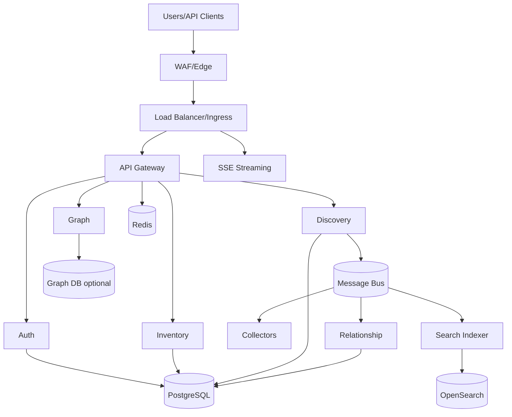

# 18. Deployment Architecture

Visentra supports multi-tenant SaaS, dedicated SaaS, BYOC managed, and BYOC self-managed deployments using the same logical services from [16-backend-services.md](./16-backend-services.md). Kubernetes is the reference runtime; managed cloud services provide persistence, cache, search, eventing, ingress, and observability.

Related: [19-kubernetes-deployment.md](./19-kubernetes-deployment.md), [20-aws.md](./20-aws.md), [21-azure.md](./21-azure.md), [22-gcp.md](./22-gcp.md), [23-security-architecture.md](./23-security-architecture.md).

## Logical topology

## HA requirements

| Layer | Requirement |
|---|---|
| Edge/load balancer | Managed multi-zone load balancer and health checks. |
| Kubernetes | Managed multi-zone control plane and node pools. |
| API/services | Minimum 2 replicas, zone spread, readiness probes. |
| Workers | Minimum 2 orchestrator/indexer/relationship replicas; collectors scale by queue. |
| PostgreSQL | Managed HA, PITR, encrypted storage. |
| Redis | Managed HA/failover; persistence if used for replay. |
| Event bus | Multi-AZ brokers or regional managed service. |
| OpenSearch | Multi-AZ, replicas, snapshots. |
| Graph | Optional HA cluster or rebuildable projection. |

## Horizontal scaling

| Component | Scaling signal |
|---|---|
| `api-gateway` | CPU, request rate, p95 latency. |
| `inventory-service` | DB pool saturation, CPU, event lag. |
| `discovery-orchestrator` | scheduled job lag, planning queue. |
| `collector-workers` | queue depth by collector kind and rate-limit budget. |
| `relationship-service` | edge queue lag, CPU. |
| `search-indexer` | index queue lag, OpenSearch pressure. |
| `streaming-service` | active SSE connections and bandwidth. |
| `graph-service` | traversal latency and graph DB load. |

## SaaS vs BYOC

| Model | Data plane | Isolation | Operations |
|---|---|---|---|
| Shared SaaS | Vendor shared cluster/data services | Logical tenant isolation | Vendor operated. |
| Dedicated SaaS | Vendor dedicated namespace/cluster/data stores | Compute/data isolation | Vendor operated. |
| BYOC managed | Customer cloud account | Customer-owned data plane | Vendor or shared operations. |
| BYOC self-managed | Customer cloud account | Customer-owned and operated | Customer operated. |

| Capability | SaaS | BYOC |
|---|---|---|
| Upgrades | Central rollout rings. | Per-environment Helm upgrades. |
| Secrets | Vendor secret manager. | Customer secret manager. |
| Networking | Public/private connectivity options. | Customer VPC/VNet native. |
| Data residency | Vendor region selection. | Customer account/subscription/project. |
| Connectors | SaaS outbound or customer-side collectors. | In-cloud collectors near resources. |

## DR targets

| Tier | Availability | RPO | RTO |
|---|---:|---:|---:|
| Standard production | 99.9% | 15 min | 2 h |
| Enterprise production | 99.95% | 5 min | 1 h |
| Critical/dedicated | 99.99% with multi-region design | 1 min | 30 min |

## Recovery model

| Data | Backup | Rebuild |
|---|---|---|
| PostgreSQL | PITR + snapshots | Restore and replay outbox. |
| Observations | Partition backups/object storage | Replay resolver. |
| Message bus | Retention window | Replay consumers. |
| OpenSearch | Snapshots | Reindex from projections. |
| Graph DB | Snapshots | Reproject from canonical edges. |
| Redis | Persistence for replay; cache disposable | Rebuild from events/projections. |

## Release strategy

1. Build immutable images with SBOM/provenance.
2. Run backward-compatible migrations.
3. Deploy via rolling update/canary.
4. Verify health, smoke tests, queue lag, error budget.
5. Roll back image if needed; schema changes must be compatible.
6. Reindex/search and graph projection changes with blue-green aliases/projections.

## Environment matrix

| Environment | Topology | Data | Seed |
|---|---|---|---|
| Local compose | Single-node compose (api, web, discovery, relationship, pg, neo4j, redis, nats, opensearch) | Ephemeral volumes | `DISCOVERY_DEMO_SEED=true` |
| Staging | Single-region K8s, managed PG/Redis | Non-prod connectors | Off |
| Production SaaS | Multi-AZ K8s + managed data plane | Customer tenants | Off |
| Production BYOC | Customer cloud account/subscription/project | Customer-owned stores | Off |

## Capacity planning (starting point)

| Tier | API replicas | Discovery workers | Postgres | OpenSearch |
|---|---:|---:|---|---|
| Eval / POC | 2 | 1–2 | 2 vCPU / 8 GB | 3× data nodes optional |
| Standard | 3–6 | 3–8 | 4–8 vCPU / 32 GB | Multi-AZ |
| Enterprise | 6–20 + HPA | Queue-driven | Aurora/HA + read replicas | Dedicated masters |

## Implementation checklist

- Containerize every service with health/readiness endpoints.
- Deploy via Helm from [19-kubernetes-deployment.md](./19-kubernetes-deployment.md).
- Externalize PostgreSQL, Redis, message bus, OpenSearch, and graph DB.
- Configure HPA/KEDA, topology spread, PDBs, and network policies.
- Define backup, restore, reindex, and graph rebuild runbooks.
