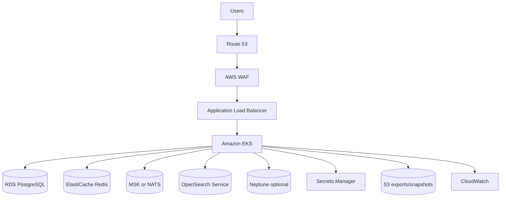

# 20. AWS

Visentra on AWS uses EKS, RDS PostgreSQL, ElastiCache Redis, OpenSearch Service, MSK/NATS, optional Neptune, ALB ingress, IAM workload identities, Secrets Manager, KMS, S3, ECR, and CloudWatch.

Related: [18-deployment-architecture.md](./18-deployment-architecture.md), [19-kubernetes-deployment.md](./19-kubernetes-deployment.md), [23-security-architecture.md](./23-security-architecture.md).

## Reference architecture



## Service mapping

| Capability | AWS service | Notes |
|---|---|---|
| Compute | Amazon EKS | Managed node groups or Karpenter. |
| Database | RDS PostgreSQL or Aurora PostgreSQL | Multi-AZ, PITR, encryption. |
| Cache | ElastiCache Redis | HA replication group, TLS. |
| Search | Amazon OpenSearch Service | Multi-AZ, dedicated cluster managers for prod. |
| Eventing | MSK, SQS/SNS, or NATS on EKS | MSK for durable Kafka-compatible stream. |
| Graph | Neptune optional | Projection from canonical edge store. |
| Ingress | AWS Load Balancer Controller + ALB | ACM TLS, WAF. |
| Secrets | Secrets Manager + KMS | Mounted via External Secrets/CSI. |
| Images | ECR | Scanning and lifecycle policies. |
| Storage | S3 | Exports, snapshots, observation attachments. |
| Observability | CloudWatch, Container Insights, OpenTelemetry | Logs, metrics, traces. |

## EKS design

| Area | Recommendation |
|---|---|
| Networking | Private app subnets for nodes/pods; public subnets only for ALB/NAT. |
| Add-ons | VPC CNI, CoreDNS, kube-proxy, EBS CSI, AWS Load Balancer Controller, External Secrets/CSI. |
| Identity | IRSA or EKS Pod Identity per Kubernetes service account. |
| Node pools | System, API, workers, memory-heavy services; spread across 3 AZs. |
| Autoscaling | HPA/KEDA for pods; Karpenter or Cluster Autoscaler for nodes. |
| Endpoints | Add VPC endpoints for ECR, S3, CloudWatch Logs, Secrets Manager, STS, KMS where private egress is required. |

## Data services

| Service | Production settings |
|---|---|
| RDS PostgreSQL | Multi-AZ, PITR, KMS encryption, private subnet, restricted SG, connection pooling. |
| ElastiCache Redis | Multi-AZ failover, TLS, auth token/IAM where appropriate, snapshots if Redis streams are durable. |
| OpenSearch | Private domain, TLS, encryption, fine-grained access control, snapshots to S3. |
| MSK/NATS | Multi-AZ brokers; retention sized for replay; separate topics for observations, inventory, graph, jobs. |
| Neptune | Multi-AZ cluster and read replicas if graph query load requires. |

## IAM

Use least-privilege roles per service account. Avoid broad wildcards and scope any `iam:PassRole` usage to specific role ARNs and services.

| Service account | Permissions |
|---|---|
| `agentradar-api-gateway` | Read selected secrets; read search if direct. |
| `agentradar-auth` | Read auth secrets; KMS decrypt signing/session material. |
| `agentradar-discovery` | Read connector metadata; publish queue/events. |
| `agentradar-collector-aws` | Assume read-only cross-account discovery role. |
| `agentradar-search-indexer` | OpenSearch write/index management. |
| `agentradar-export-worker` | Write/read scoped S3 export prefixes. |

Cross-account discovery:

1. Customer creates `VisentraDiscoveryRole` in target accounts.
2. Trust policy allows collector role with external ID.
3. Permissions are read-only and scoped to enabled collectors.
4. Collector uses resource ARNs as strong identity keys.

## ALB ingress

```yaml
metadata:
  annotations:
    kubernetes.io/ingress.class: alb
    alb.ingress.kubernetes.io/scheme: internet-facing
    alb.ingress.kubernetes.io/target-type: ip
    alb.ingress.kubernetes.io/listen-ports: '[{"HTTPS":443}]'
    alb.ingress.kubernetes.io/healthcheck-path: /healthz
```

Set longer idle timeout for SSE routes and attach AWS WAF for public endpoints.

## Backup and DR

| Component | AWS mechanism |
|---|---|
| PostgreSQL | Automated backups, PITR, snapshots, cross-region snapshot copy. |
| OpenSearch | Automated/manual snapshots to S3. |
| S3 | Versioning, lifecycle, optional retention policies. |
| MSK | Topic retention and consumer offset replay. |
| Neptune | Automated backups/snapshots. |

## Implementation checklist

- Provision VPC with public, private app, and private data subnets across at least 3 AZs.
- Deploy EKS and workload identity.
- Provision RDS, ElastiCache, OpenSearch, event bus, optional Neptune.
- Configure ALB, ACM, WAF, Secrets Manager, KMS, S3, ECR, and CloudWatch.
- Deploy Helm chart with `values-aws.yaml`.
