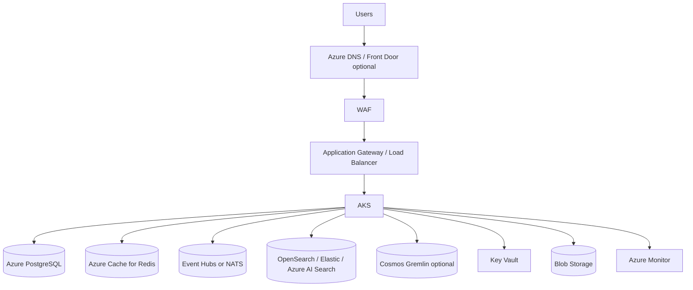

# 21. Azure

AgentRadar on Azure uses AKS, Azure Database for PostgreSQL Flexible Server, Azure Cache for Redis, OpenSearch/Elastic or Azure AI Search adapter, Event Hubs/NATS, optional Cosmos DB Gremlin, Application Gateway or NGINX ingress, Key Vault, managed identities, Blob Storage, ACR, and Azure Monitor.

Related: [18-deployment-architecture.md](./18-deployment-architecture.md), [19-kubernetes-deployment.md](./19-kubernetes-deployment.md), [23-security-architecture.md](./23-security-architecture.md).

## Reference architecture

## Service mapping

| Capability | Azure service | Notes |
|---|---|---|
| Compute | AKS | Private cluster for production BYOC where possible. |
| Database | Azure Database for PostgreSQL Flexible Server | Zone-redundant HA, PITR. |
| Cache | Azure Cache for Redis | Premium/Enterprise for HA/persistence. |
| Search | Elastic Cloud, self-managed OpenSearch, or Azure AI Search | Azure AI Search requires API adapter. |
| Eventing | Event Hubs, Service Bus, or NATS | Event Hubs for durable stream; Service Bus for command queues. |
| Graph | Cosmos DB Gremlin optional | Projection from canonical edge store. |
| Ingress | Application Gateway Ingress Controller, Front Door, or NGINX | WAF and TLS. |
| Secrets | Key Vault | CSI/External Secrets. |
| Images | Azure Container Registry | Private link and scanning integration. |
| Storage | Blob Storage | Exports and snapshots. |
| Observability | Azure Monitor, Log Analytics, Managed Prometheus | Logs, metrics, traces. |

## AKS design

| Area | Recommendation |
|---|---|
| Networking | Dedicated VNet, AKS subnet, private endpoint subnet, NAT/Firewall egress. |
| Identity | Microsoft Entra Workload ID per Kubernetes service account. |
| Add-ons | Azure CNI, CSI Secrets Store Provider, Container Insights, Managed Prometheus optional. |
| Node pools | System pool plus API, worker, and memory-optimized pools. |
| Autoscaling | Cluster autoscaler, HPA, KEDA. |
| Private endpoints | PostgreSQL, Key Vault, Redis, Storage, ACR, search where supported. |

## Data services

| Service | Production settings |
|---|---|
| PostgreSQL Flexible Server | Zone-redundant HA, PITR, private access, encryption, maintenance window. |
| Azure Cache for Redis | TLS, private endpoint/VNet injection, persistence when replay relies on Redis. |
| Search | Prefer OpenSearch/Elastic for parity with [15-search-architecture.md](./15-search-architecture.md); Azure AI Search adapter if Azure-native is required. |
| Event Hubs/NATS | Consumer groups per service; retention sized for replay. |
| Cosmos Gremlin | Partition by tenant/scope; session consistency usually sufficient for UI graph projection. |

## Managed identity permissions

| Service account | Permissions |
|---|---|
| `agentradar-api-gateway` | Read selected Key Vault secrets and search read credentials where needed. |
| `agentradar-auth` | Read auth secrets/signing material. |
| `agentradar-discovery` | Read connector metadata, publish events/tasks. |
| `agentradar-collector-azure` | Reader permissions on target subscriptions/resource groups; Log Analytics read where enabled. |
| `agentradar-search-indexer` | Search index write credentials. |
| `agentradar-export-worker` | Blob Storage write/read scoped to export container/prefix. |

Cross-subscription discovery uses workload identity/service principal with read-only roles scoped to enabled subscriptions/resource groups.

## Ingress options

| Option | Use |
|---|---|
| Application Gateway Ingress Controller | Enterprise WAF and TLS with AKS integration. |
| Azure Front Door + internal ingress | Global edge and multi-region routing. |
| NGINX + Azure Load Balancer | Simpler BYOC/internal deployments. |

Set long timeouts for SSE and disable response buffering where applicable.

## Backup and DR

| Component | Azure mechanism |
|---|---|
| PostgreSQL | Automated backups, PITR, geo-redundant backup option. |
| Redis | Tier-specific persistence/snapshots. |
| Blob | Versioning, lifecycle, optional immutable storage. |
| Event Hubs | Retention and Capture to Blob if long-term archive is needed. |
| Search | Snapshots for OpenSearch; managed backup strategy for selected service. |
| Cosmos Gremlin | Continuous backup where available. |

## Implementation checklist

- Provision VNet, subnets, private endpoints, private DNS, and egress.
- Deploy AKS with Workload ID.
- Provision PostgreSQL, Redis, search, Event Hubs/NATS, optional Cosmos Gremlin.
- Configure ingress, TLS, WAF, Key Vault, ACR, Blob Storage, and Azure Monitor.
- Deploy Helm chart with `values-azure.yaml`.
