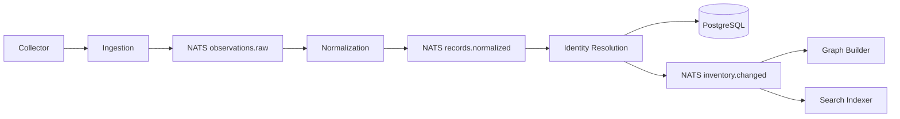
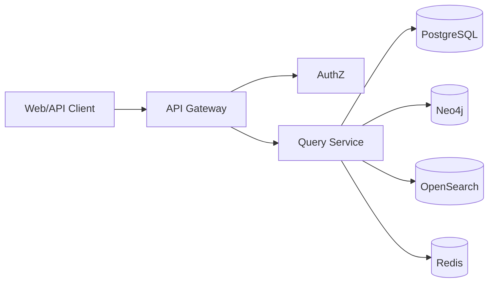

# 22 - Backend Services

## Overview

Visentra backend services are organized around ingestion, normalization, identity resolution, graph construction, search indexing, querying, export, collector management, authorization, and operations. Services communicate through REST/gRPC for request/response and NATS for durable event streams.

## Service Inventory

| Service | Primary Responsibility |
|---|---|
| API Gateway | Authenticated REST routing, rate limits, audit context. |
| AuthZ Service | RBAC, scopes, field access decisions. |
| Collector Management | Enrollment, config, health, upgrades. |
| Ingestion | Signed observation intake and raw evidence storage. |
| Normalization | Source-to-canonical mapping and evidence generation. |
| Identity Resolution | Agent dedupe, confidence, canonical updates. |
| Graph Builder | Neo4j node/edge projection. |
| Search Indexer | OpenSearch projections and reindexing. |
| Query Service | Inventory, graph, timeline, search composition. |
| Export Service | Async export jobs and artifact management. |
| Integration Service | Inbound/outbound connector orchestration. |
| Notification Service | Export/discovery UI notifications. |

## Service Boundaries

- Ingestion does not perform identity resolution.
- Normalization does not write graph edges directly.
- Query Service does not mutate canonical inventory.
- Export Service reads through stable query contracts where possible.
- AuthZ decisions are centralized and cached safely.

## Write Path Services

## Read Path Services

## Failure Principles

- Services are idempotent.
- Consumers can replay from NATS.
- Dead-letter queues are visible in Data Quality.
- Degraded dependencies surface explicit UI states.
- Backpressure is preferable to data loss.

## Deployment Units

Each service should deploy independently with:

- Health endpoint.
- Readiness endpoint.
- Metrics endpoint.
- Structured logging.
- Graceful shutdown.
- Config through environment/secret manager.

## Service SLO Targets

| Service | Target |
|---|---|
| API Gateway | 99.9% availability. |
| Query Service | p95 common inventory reads < 1.5s. |
| Ingestion | Accept or reject batch < 500ms p95 excluding payload upload. |
| Normalization | Pipeline lag < 5 minutes under normal load. |
| Graph Builder | Relationship projection lag < 10 minutes under normal load. |
| Export Service | Small exports < 30s; large exports async. |

## Related Documents

- [02-product-architecture.md](./02-product-architecture.md)
- [25-observability-and-operations.md](./25-observability-and-operations.md)
- [27-performance-and-scale.md](./27-performance-and-scale.md)
