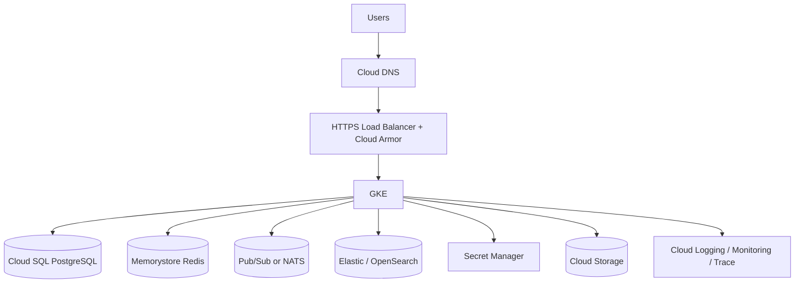

# 22. GCP

Visentra on Google Cloud uses GKE, Cloud SQL for PostgreSQL, Memorystore for Redis, Elastic/OpenSearch-compatible search, Pub/Sub or NATS, optional graph projection alternatives, Google Cloud Load Balancing, Secret Manager, Artifact Registry, Cloud Storage, and Cloud Operations.

Related: [18-deployment-architecture.md](./18-deployment-architecture.md), [19-kubernetes-deployment.md](./19-kubernetes-deployment.md), [23-security-architecture.md](./23-security-architecture.md).

## Reference architecture

## Service mapping

| Capability | GCP service | Notes |
|---|---|---|
| Compute | GKE Standard or Autopilot | Standard for fine-grained node pools; Autopilot for simplified operations. |
| Database | Cloud SQL for PostgreSQL | Regional HA, PITR. |
| Cache | Memorystore for Redis | Standard tier for HA. |
| Search | Elastic Cloud on GCP or self-managed OpenSearch on GKE | OpenSearch preserves reference API semantics. |
| Eventing | Pub/Sub, Pub/Sub Lite, or NATS | Pub/Sub for managed durable eventing. |
| Ingress | External/internal HTTPS Load Balancer, GKE Gateway/Ingress | Cloud Armor for public edge. |
| Secrets | Secret Manager | CSI/External Secrets. |
| Images | Artifact Registry | Private repositories and scanning integration. |
| Storage | Cloud Storage | Exports, snapshots, attachments. |
| Observability | Cloud Logging, Monitoring, Trace, Managed Service for Prometheus | Logs, metrics, traces. |

## GKE design

| Area | Recommendation |
|---|---|
| Cluster | Private GKE cluster for production BYOC. |
| Workload identity | Map Kubernetes service accounts to IAM service accounts. |
| Networking | Dedicated VPC, private service access, Cloud NAT for controlled egress. |
| Node pools | System, API, worker, memory-optimized pools for GKE Standard. |
| Autoscaling | HPA/KEDA plus cluster autoscaler or Autopilot. |
| Add-ons | Secret Manager CSI/External Secrets, Managed Prometheus, Gateway/Ingress. |

## Data services

| Service | Production settings |
|---|---|
| Cloud SQL PostgreSQL | Regional HA, PITR, private IP, CMEK where required, PgBouncer in GKE. |
| Memorystore Redis | Standard tier, private connectivity, persistence options based on replay requirements. |
| Search | Elastic/OpenSearch with snapshots to Cloud Storage; adapter required for other engines. |
| Pub/Sub | Topics/subscriptions per event class, retention sized for replay, ordering keys where required. |
| Cloud Storage | Versioning, lifecycle policies, retention policies where required. |

## IAM and workload identity

| Service account | Permissions |
|---|---|
| `agentradar-api-gateway` | Read selected secrets/search credentials if needed. |
| `agentradar-auth` | Read auth secrets and signing material from Secret Manager/KMS. |
| `agentradar-discovery` | Publish tasks/events and read connector metadata. |
| `agentradar-collector-gcp` | Read-only discovery permissions scoped to projects/folders. |
| `agentradar-search-indexer` | Search index write credentials/access. |
| `agentradar-export-worker` | Write/read scoped Cloud Storage export prefixes. |

Cross-project discovery uses a deployment-project service account granted read-only roles in target projects/folders. GCP resource names/self-links are strong identity keys.

## Ingress

| Area | Recommendation |
|---|---|
| TLS | Google-managed or customer-provided certificates. |
| Edge | External HTTPS Load Balancer for public; internal LB for private. |
| WAF | Cloud Armor policy for public deployments. |
| Gateway | Prefer GKE Gateway API where supported. |
| SSE | Configure backend timeout for long-lived event streams. |

## Backup and DR

| Component | GCP mechanism |
|---|---|
| PostgreSQL | Cloud SQL automated backups, PITR, cross-region strategy where required. |
| Redis | Memorystore failover and tier-specific backup features. |
| Pub/Sub | Retention and subscription snapshots. |
| Search | Snapshots to Cloud Storage or managed search backup. |
| Cloud Storage | Versioning, lifecycle, retention. |
| GKE manifests | Helm values/chart versions in Git. |

## Implementation checklist

- Provision VPC, private GKE, Cloud NAT, and private service access.
- Deploy GKE with Workload Identity.
- Provision Cloud SQL, Memorystore, search, Pub/Sub/NATS, Secret Manager, Artifact Registry, Cloud Storage.
- Configure HTTPS load balancer, Cloud Armor, Cloud DNS, and observability.
- Deploy Helm chart with `values-gcp.yaml`.
