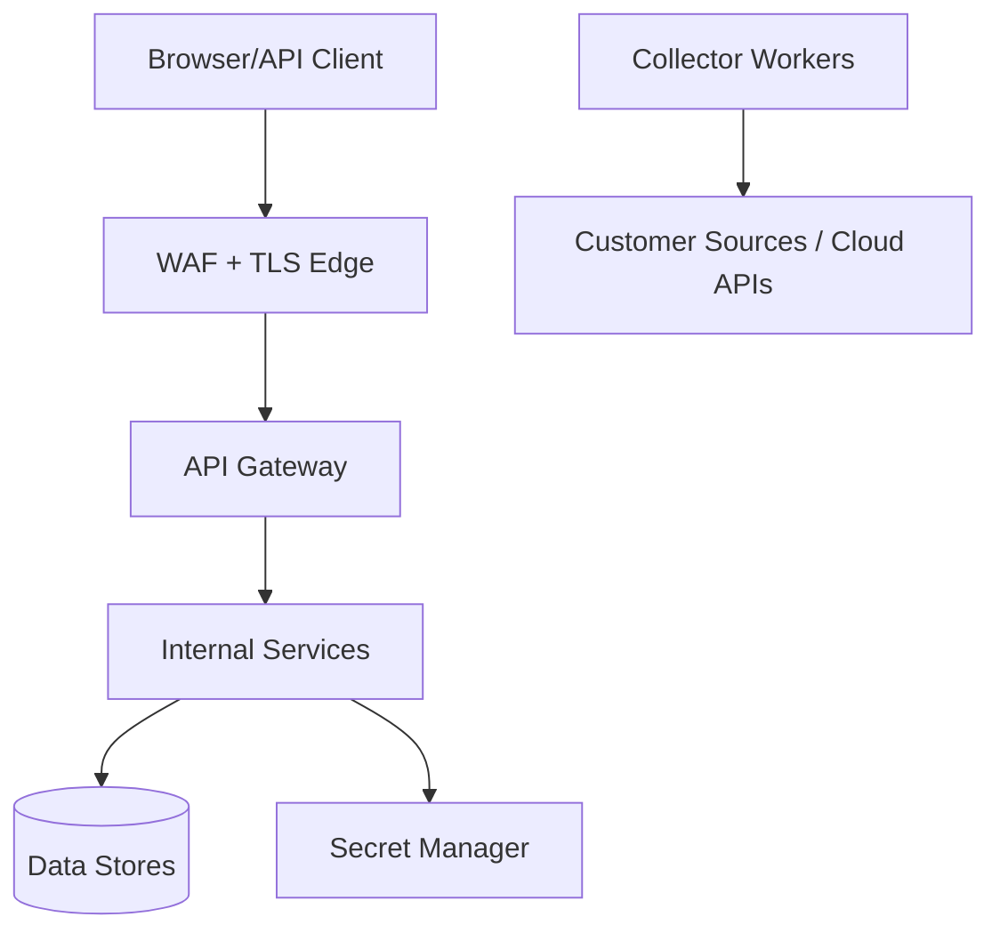

# 23. Security Architecture

This blueprint covers AgentRadar platform security: authentication, authorization, SSO, RBAC, secrets, network isolation, tenant isolation, auditability, and secure operations. It intentionally avoids product governance or enforcement features.

Related: [11-apis.md](./11-apis.md), [18-deployment-architecture.md](./18-deployment-architecture.md), [19-kubernetes-deployment.md](./19-kubernetes-deployment.md), [20-aws.md](./20-aws.md), [21-azure.md](./21-azure.md), [22-gcp.md](./22-gcp.md).

## Trust boundaries

| Boundary | Controls |
|---|---|
| Internet -> edge | TLS, WAF, rate limits, secure headers. |
| Edge -> gateway | Health checks, TLS termination, request ID propagation. |
| Gateway -> services | Internal auth, tenant context, network policies. |
| Services -> data | Private networking, TLS, scoped credentials. |
| Collectors -> sources | Connector-specific credentials and controlled egress. |
| Tenant -> tenant | Tenant predicates, storage partitioning, cache key scoping, isolation tests. |

## Authentication

| Mode | Use |
|---|---|
| Local username/password | BYOC bootstrap and standalone installs. |
| OIDC authorization code | Enterprise SSO with Entra ID, Okta, Auth0, Google, Ping, etc. |
| SAML 2.0 | Enterprises with SAML-only IdPs. |
| API tokens | Automation and integrations. |

| Token | Lifetime | Storage |
|---|---:|---|
| Access token | 5-15 min | Memory or httpOnly secure cookie. |
| Refresh/session token | 8-24 h default | httpOnly secure cookie/server-side session. |
| CSRF token | Session-bound | Double-submit cookie + header. |
| API token | Configurable | Hash only in database; value shown once. |

OIDC validation: issuer, audience, signature/JWKS, nonce/state, time bounds, group claims. SAML validation: signature, issuer, audience, recipient, replay cache, time bounds, attribute mapping.

## Authorization and RBAC

| Role | Access summary |
|---|---|
| `platform_admin` | Tenant, user, connector, and inventory administration. |
| `ciso` | Read dashboards, inventory, graph, search, exports, user summaries. |
| `analyst` | Read inventory; run discovery jobs; update operational metadata; create exports. |
| `auditor` | Read-only dashboards, inventory, graph, search, exports, audit records. |
| `service_account` | Explicit token grants only. |

| Permission | Admin | CISO | Analyst | Auditor |
|---|---:|---:|---:|---:|
| `agents:read` | Yes | Yes | Yes | Yes |
| `agents:update_metadata` | Yes | No | Yes | No |
| `assets:read` | Yes | Yes | Yes | Yes |
| `graph:read` | Yes | Yes | Yes | Yes |
| `search:read` | Yes | Yes | Yes | Yes |
| `discovery:job:run` | Yes | No | Yes | No |
| `discovery:connector:write` | Yes | No | Conditional | No |
| `export:create` | Yes | Yes | Yes | Conditional |
| `users:manage` | Yes | No | No | No |
| `tenant:manage` | Yes | No | No | No |

Every request checks authentication, tenant membership, permission, resource tenant ownership, and optional object constraints.

## Tenant isolation

| Layer | Control |
|---|---|
| API | Tenant from session; `X-Tenant-Id` accepted only for authorized memberships. |
| Database | `tenant_id` on every business table; scoped repositories or row-level security. |
| Search | `tenantId` field required and applied to every query. |
| Graph | Nodes/edges include tenant ID; traversal includes tenant predicate. |
| Cache | Tenant-prefixed keys. |
| Event bus | Tenant partition key and consumer validation. |
| Secrets | Tenant/connector-scoped secret names and access. |
| Exports | Tenant-scoped object prefixes and expiring URLs. |

## Secrets

| Secret | Store | Access |
|---|---|---|
| Database credentials | Cloud secret manager | DB-using services. |
| JWT/session keys | Secret manager or KMS | Auth; public verifier to gateway when asymmetric. |
| OIDC/SAML secrets | Secret manager | Auth only. |
| Connector credentials | Secret manager | Matching collector workers only. |
| API tokens | Hashed DB record | Never recover raw value. |

Rules: never log secrets, redact known patterns, avoid raw prompt/credential indexing, prefer workload identity over static keys, rotate with version metadata.

## Network isolation

| Area | Control |
|---|---|
| Public ingress | Expose only gateway and streaming routes. |
| Internal services | ClusterIP and network policies. |
| Data stores | Private endpoints/subnets, no public access in production. |
| Collector egress | NAT/firewall/proxy and allowlist where practical. |
| Admin access | Cloud-native audited access; no public SSH to nodes. |
| TLS | Required externally; internal mTLS recommended for full microservice mode. |

## Audit events

| Event | Required fields |
|---|---|
| Login success/failure | User, tenant, IdP, IP hash, user agent, request ID. |
| Role/membership change | Actor, subject, tenant, changed roles. |
| Connector secret change | Actor, connector ID, secret version metadata. |
| Discovery job launched/cancelled | Actor, scope summary, job ID. |
| Export created/downloaded | Actor, export ID, filters summary, format. |
| API token created/revoked | Actor, token ID, scopes. |

## Threat model (summary)

| Threat | Mitigation |
|---|---|
| Cross-tenant data access | `tenant_id` on every row/node; JWT `tid` claim; isolation tests |
| Stolen connector secrets | Envelope encryption + KMS; never return raw secrets; rotation metadata |
| SSRF via connector URLs | Allowlists + `safeFetch` in collectors |
| Privilege escalation | RBAC roles (`platform_admin` / `operator` / `viewer`); write endpoints gated |
| Token theft | Short JWT TTL; HTTPS only; optional Entra SSO |
| Inventory poisoning | Confidence scoring, evidence classes, audit of discovery jobs |

## Compliance mapping (visibility track)

| Control theme | How AgentRadar helps (visibility only) |
|---|---|
| Asset inventory | Continuous AI agent CMDB |
| Access review | Owner attribution + ownerless queue |
| Change evidence | Discovery events + audit_read |
| Segregation of duties | RBAC on connectors/discovery/export |

Governance/enforcement controls are explicitly out of scope for this track.

## Implementation checklist

- Implement tenant-scoped auth middleware and permission helpers.
- Integrate OIDC/SAML with configurable claim mapping.
- Store secrets in cloud secret manager via Kubernetes integration.
- Add network policies and private data endpoints.
- Add redaction utilities for logs, observations, errors, and search docs.
- Add automated isolation tests for REST, search, graph, SSE, and export.
