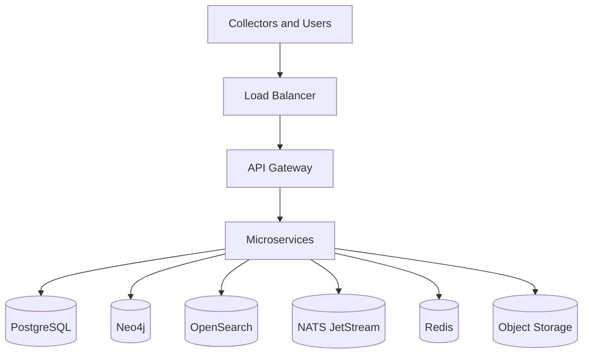

# 24 - Deployment Architecture

## Overview

AgentRadar should support multi-tenant SaaS, customer-managed single-tenant, and hybrid collector deployment models. The platform must handle enterprise security, data residency, scalability, upgrades, and operational observability.

## Deployment Models

| Model | Description | Customer Fit |
|---|---|---|
| SaaS Multi-Tenant | AgentRadar hosted control plane and data plane. | Most customers. |
| Single-Tenant SaaS | Dedicated tenant infrastructure. | Larger regulated enterprises. |
| Customer-Managed | Customer runs platform in their cloud. | Highly regulated or data-residency-driven. |
| Hybrid Collectors | Collectors run in customer environment and call SaaS outbound. | Default for endpoints/cloud/private networks. |

## SaaS Topology

## Environment Strategy

- Development.
- Staging.
- Production.
- Dedicated customer environments where needed.
- Regional production environments for data residency.

## Infrastructure Requirements

- Kubernetes or equivalent orchestrator.
- Managed PostgreSQL.
- Managed OpenSearch or equivalent.
- Neo4j cluster/managed service.
- NATS JetStream cluster.
- Managed Redis.
- Object storage.
- Secret manager.
- Observability stack.

## Network Model

- Collectors initiate outbound connections.
- No inbound customer network access required for SaaS collectors.
- PrivateLink/VPC peering can be later enterprise option.
- Egress allowlists documented per connector.

## Release Strategy

- Independent service deployments.
- Database migrations with backward-compatible phases.
- Versioned event schemas.
- Blue/green or rolling deployment.
- Feature flags for new connectors and UI screens.

## Data Residency

- Tenant data pinned to region.
- Object storage region matches tenant region.
- Cross-region support access is audited and minimized.
- Export destinations configured per tenant.

## Backup and Recovery

- PostgreSQL point-in-time recovery.
- Neo4j backups.
- OpenSearch snapshotting.
- Object storage versioning where appropriate.
- NATS stream backup or replay from canonical stores where feasible.

## Related Documents

- [02-product-architecture.md](./02-product-architecture.md)
- [19-security-and-access-control.md](./19-security-and-access-control.md)
- [25-observability-and-operations.md](./25-observability-and-operations.md)
