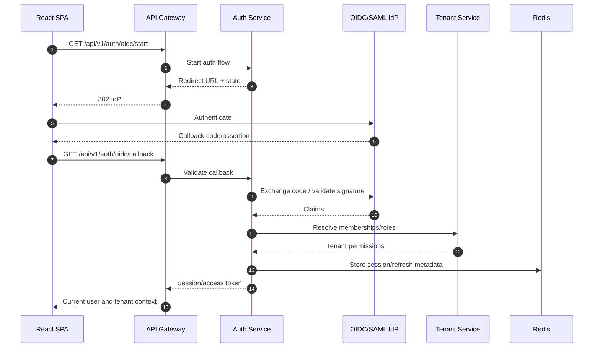
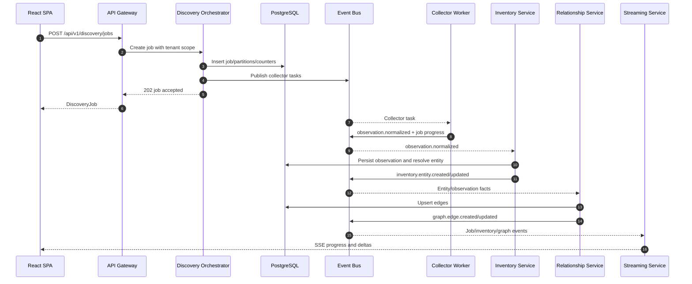
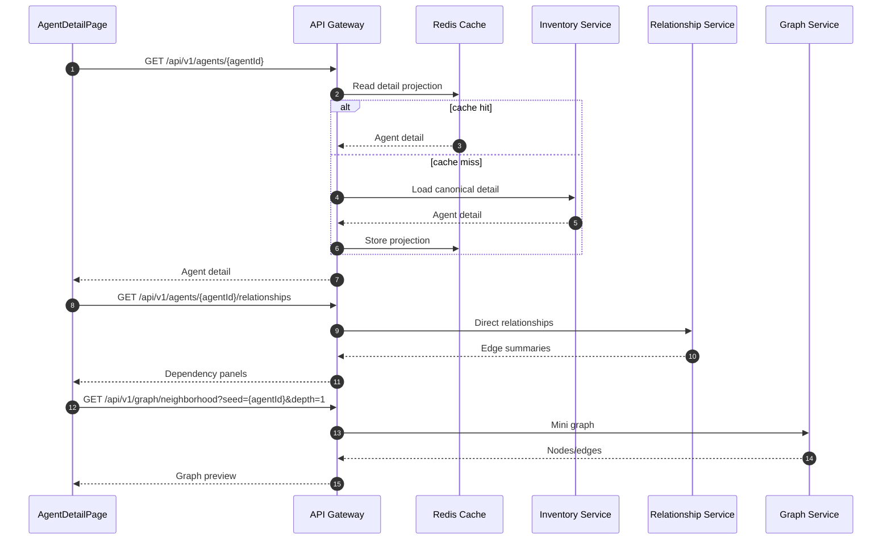
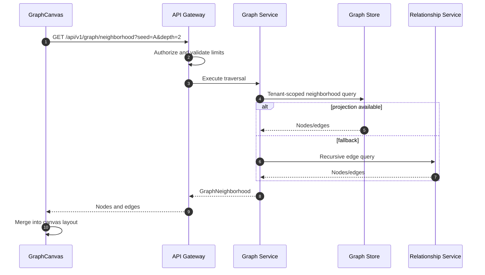
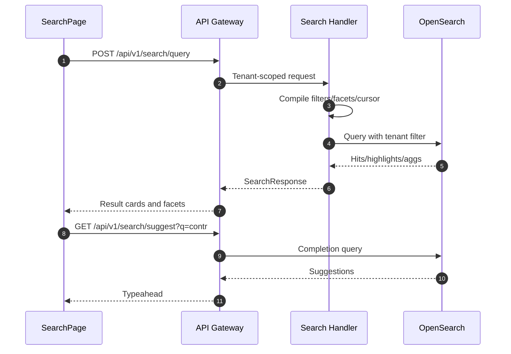
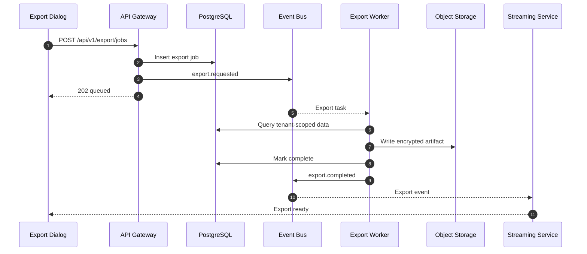

# 25. Sequence Diagrams

Primary AgentRadar interactions are shown below. APIs are defined in [11-apis.md](./11-apis.md); data flows are expanded in [26-data-flow-diagrams.md](./26-data-flow-diagrams.md).

## Login

## Discovery job

## Agent detail load

## Graph expand

## Search

## Export

