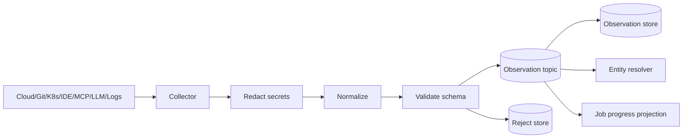
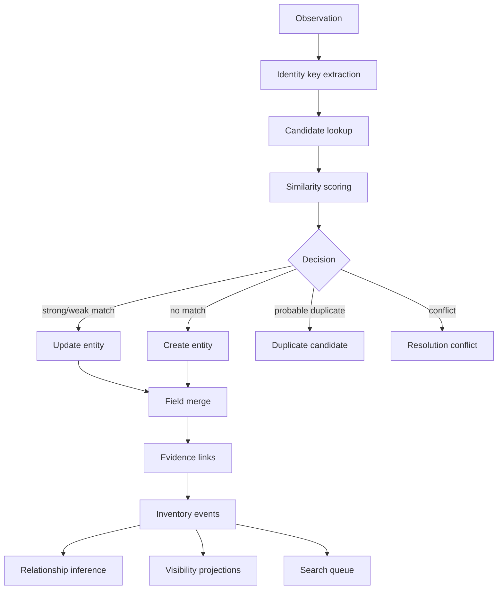
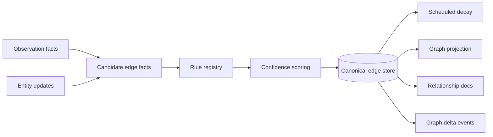
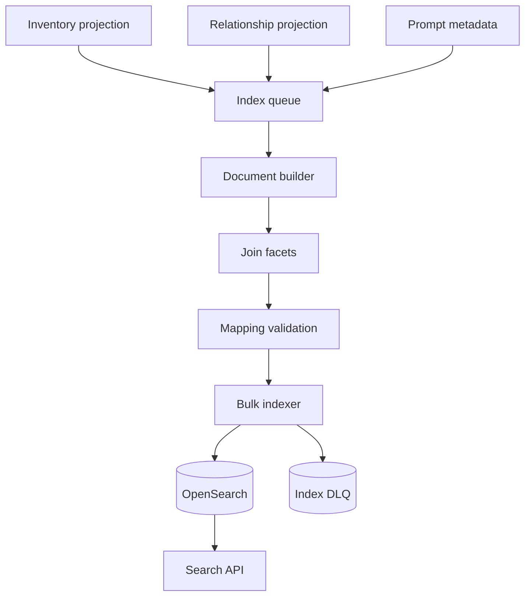
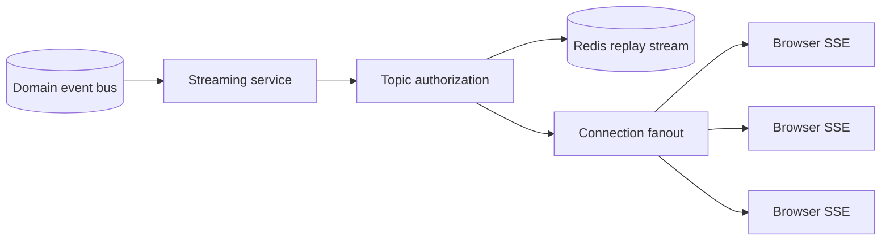
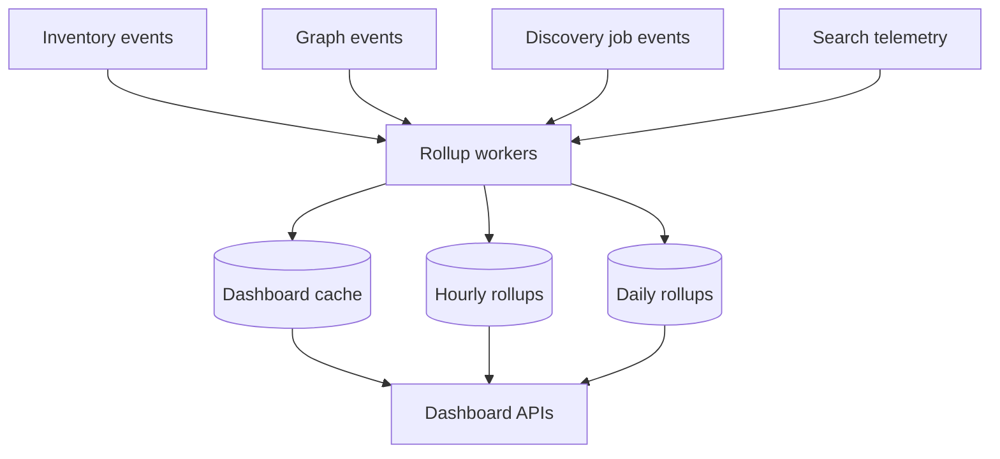
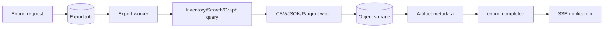

# 26. Data Flow Diagrams

These diagrams show how AgentRadar data moves from discovery sources into observations, entity resolution, relationships, search, dashboards, and realtime UI updates.

Related: [12-discovery-engine.md](./12-discovery-engine.md), [13-visibility-engine.md](./13-visibility-engine.md), [14-relationship-engine.md](./14-relationship-engine.md), [15-search-architecture.md](./15-search-architecture.md), [27-discovery-workflow.md](./27-discovery-workflow.md).

## Observation ingest

| Stage | Input | Output |
|---|---|---|
| Collect | Source payload/event | Raw collector payload. |
| Redact | Raw payload | Safe metadata payload. |
| Normalize | Safe payload | Observation envelope. |
| Validate | Observation | Accepted event or rejection. |
| Persist | Event | Immutable observation row. |

## Entity resolution

Stores: `observations`, `entities`, `entity_aliases`, `entity_field_evidence`, `resolution_decisions`, `duplicate_candidates`.

## Relationship inference

## Search indexing

Index inputs include owner, model, framework, cloud, repo, tool, prompt, language, department, risk, hostname, project, BU, graph degree, confidence, and recency.

## Realtime fanout

SSE flow:

1. Consume tenant-partitioned domain event.
2. Validate session/topic authorization.
3. Store recent event in Redis replay stream.
4. Send `event`, `id`, and JSON `data`.
5. Replay from `Last-Event-ID` on reconnect or fall back to REST polling.

## Dashboard aggregation

## Export flow

## Implementation checklist

- Define schemas for every event boundary.
- Include entity versions and idempotency keys in stream consumers.
- Add DLQs for rejects, conflicts, and index failures.
- Add replay commands for resolver, relationship, search, graph, and dashboards.
- Add end-to-end tests that trace one synthetic observation to UI-facing APIs.
