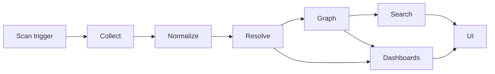

# 27. Discovery Workflow

This blueprint defines the end-to-end workflow from scan to UI: scan -> normalize -> resolve -> graph -> search -> UI. The engine details are in [12-discovery-engine.md](./12-discovery-engine.md), graph rules in [14-relationship-engine.md](./14-relationship-engine.md), and data flows in [26-data-flow-diagrams.md](./26-data-flow-diagrams.md).

## Workflow



## Phases

| Phase | Owner | Input | Output |
|---|---|---|---|
| Trigger | Scheduler/API/webhook | Schedule, manual request, source event | Job and task plan. |
| Scan | Collector workers | Connector config, scope, cursor | Raw payloads and observations. |
| Normalize | Collector SDK | Raw payloads | Observation envelopes. |
| Persist | Inventory | Observations | Immutable observation rows. |
| Resolve | Inventory | Observations and identity keys | Canonical agents/assets. |
| Infer | Relationship | Entity updates and edge facts | Canonical edges. |
| Project | Graph/visibility | Edge/entity/job events | Graph and dashboard read models. |
| Index | Search indexer | Entity/edge projections | OpenSearch docs. |
| Present | API/SSE/frontend | Projections/events | Tables, graph, dashboards, search. |

## Trigger details

| Trigger | Example |
|---|---|
| Scheduled | AWS cloud API every 30 minutes. |
| Manual | Analyst launches namespace scan. |
| Webhook | Git push or CI deploy completed. |
| Watch | K8s workload changed. |
| Backfill | New collector version requires replay/rescan. |

Manual request:

```json
{
  "name": "prod namespace refresh",
  "scope": {"connectors": ["conn_k8s_prod"], "include": {"kubernetesNamespaces": ["legal-ai"]}},
  "priority": "high",
  "reason": "operator-requested refresh"
}
```

## Scan and normalize

Collectors partition work by source:

| Collector | Partition |
|---|---|
| Cloud API | Account/subscription/project + region/service. |
| Kubernetes | Cluster + namespace or watch event. |
| Git | Org/repo/path range or commit delta. |
| CI/CD | Pipeline run or deployment event. |
| Runtime/process | Host/pod/process batch. |
| Network/log | Time window and source query. |
| MCP | Config path, endpoint, or client process. |
| LLM API | Provider org/project and usage window. |

Normalization rules:

- Redact secrets before observation creation.
- Prefer structured parsers for code/config.
- Preserve source hashes and external IDs.
- Emit tombstones for disappeared source objects.
- Validate observation schema before publish.

## Resolve

| Evidence result | Action |
|---|---|
| Strong key matches existing entity | Update entity and field evidence. |
| Strong key new | Create entity. |
| Weak keys high-confidence match | Merge. |
| Probable weak match | Link duplicate candidate. |
| Immutable conflict | Record conflict; do not merge. |
| Tombstone | Update lifecycle/source state. |

Field merge prioritizes explicit source-of-truth metadata, fresh runtime evidence, source declarations, aliases, and max `lastObservedAt`.

## Graph

Relationship service consumes observations and entity changes to infer:

- `Developer -> IDE`
- `IDE -> Repository`
- `Repository -> Agent`
- `Agent -> Model`
- `Agent -> Tool`
- `Tool -> MCP Server`
- `Agent/Tool -> DB/Vector Store/Bucket/Queue`
- `Agent/Tool -> Cloud Resource`
- `Agent/Tool -> API -> External Service`

Edges include confidence, evidence, first/last observed, state, and decay metadata.

## Search

Search indexer builds:

| Document | Source |
|---|---|
| Agent | Agent summary + direct relationship facets. |
| Asset | Asset summary + used-by relationships. |
| Prompt | Prompt metadata and hashes/summaries where allowed. |
| Relationship | Edge endpoints and evidence summary. |
| Observation | Metadata-only evidence summary. |

Required facets from [15-search-architecture.md](./15-search-architecture.md): owner, model, framework, cloud, repo, tool, prompt, language, department, risk, hostname, project, BU.

## UI update

| UI surface | Data |
|---|---|
| Dashboard | Rollups and coverage projection. |
| Agent inventory | Agent summary projection and search facets. |
| Agent detail | Detail projection, relationships, observations, mini graph. |
| Graph explorer | Graph neighborhood/path APIs. |
| Search | OpenSearch cards and facets. |
| Discovery monitor | Job projection and SSE events. |
| Coverage map | Coverage scope projection. |

## Timing targets

| Segment | Target |
|---|---:|
| Manual job accepted | < 1 second. |
| Collector task leased | < 30 seconds. |
| Entity resolved | < 10 seconds from observation publish p95. |
| Edge inferred | < 15 seconds p95. |
| Search indexed | < 30 seconds p95. |
| SSE delivered | < 2 seconds p95. |
| Dashboard updated | < 60 seconds. |

## Replay and rebuild

| Need | Approach |
|---|---|
| Resolver change | Replay observations through resolver. |
| Rule change | Replay edge facts/entity observations. |
| Search mapping change | Full reindex and alias swap. |
| Graph drift | Rebuild projection from canonical edges. |
| Dashboard drift | Rebuild rollups from events/projections. |

## Implementation checklist

- Implement job state machine: queued, running, checkpointed, completed, failed, cancelled.
- Persist observations before resolution.
- Log resolver decisions and conflicts.
- Emit projection events for graph, search, dashboard, and SSE.
- Add synthetic end-to-end test from observation ingest to UI-facing APIs.
