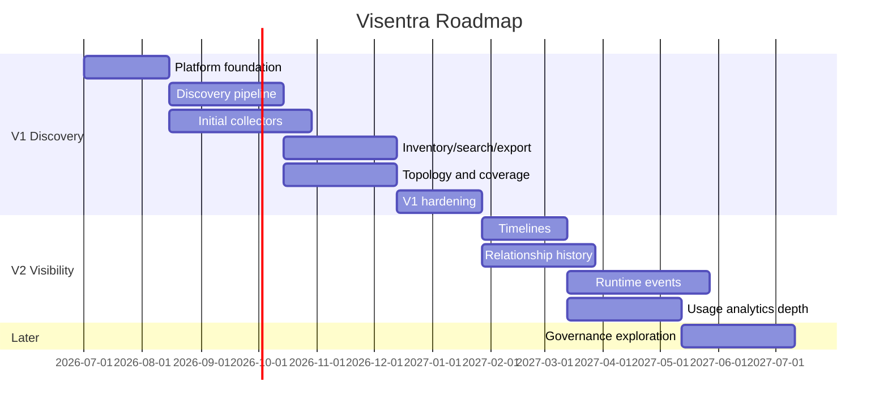

# 30 - Roadmap

## Overview

Visentra's roadmap is intentionally staged. The product must first become the enterprise system of record for AI agent discovery, then deepen into runtime visibility, and only later consider governance or remediation. This sequencing keeps the initial product focused, credible, and implementable.

## Roadmap Summary

| Phase | Theme | Scope |
|---|---|---|
| V1 | Discovery | Find, normalize, inventory, search, map, and export AI agent assets. |
| V2 | Visibility Depth | Timelines, activity signals, relationship history, usage trends, realtime investigation. |
| Later | Governance | Possible policy, approval, remediation, and enforcement workflows; explicitly out of scope now. |

## V1: Discovery

### Product Promise

V1 answers: **What AI agents exist in the enterprise, where are they, who owns them, what do they use, and how confident are we?**

### V1 Capabilities

- Multi-source discovery.
- Collector enrollment and health.
- Discovery runs.
- Normalization pipeline.
- Agent identity resolution.
- Canonical asset inventory.
- Relationship graph projection.
- Agent, model, tool, MCP, IDE, cloud, container, SaaS, browser, local LLM, identity, repository inventory.
- Global search and facets.
- Topology map.
- Relationship Explorer.
- Evidence-backed detail views.
- Coverage Map.
- Discovery events.
- Export.
- RBAC and audit.

### V1 Source Coverage

V1 is **agentless-first**, with architecture ready for the full category set:

- Cloud / containers / K8s (API connectors).
- SaaS / MCP / LLM provider APIs.
- Git / CI/CD / logs / identity.
- Framework and autonomous agents visible via cloud, repo, and runtime signals.
- **Endpoint / IDE / local LLM / browser** via **EDR integrations** (CrowdStrike, Defender/Intune, Cortex, Netskope, etc.) — not via a Visentra local client.

### V1 Success Criteria

- Customers can complete a first discovery run.
- Inventory is searchable and exportable.
- Every agent has evidence and confidence.
- Core relationships appear in topology.
- Coverage gaps are visible.
- Product language remains discovery/visibility oriented.

### V1 Non-Goals

- Policy enforcement.
- Agent approval workflows.
- Automated remediation.
- Blocking or disabling tools.
- Prompt/content governance.
- Runtime kill switch.
- **Deploying a proprietary Visentra endpoint agent / IDE plugin as a required install.**

## V2: Visibility Depth

### Product Promise

V2 answers: **What are discovered agents doing over time, how are their relationships changing, and which runtime paths explain activity, usage, and exposure?**

### V2 Capabilities

- Agent timeline.
- Relationship history.
- Activity event ingestion where available.
- Runtime state changes.
- Model/tool/MCP usage trends.
- New/dormant/reactivated agent views.
- Relationship change detection.
- Realtime event streams.
- Time-sliced topology.
- Usage analytics by team, source, model, framework, cloud, IDE, MCP, SaaS, and local runtime.
- Historical snapshots for audit.

### V2 Data Expansion

V2 may add:

- Runtime activity metadata.
- Tool invocation metadata where safely available.
- Model call metadata where safely available.
- Cost/volume metadata where integrations expose it.
- Relationship change history.

V2 should still avoid prompt and response content by default.

### V2 Success Criteria

- Users can reconstruct agent changes over time.
- SecOps can investigate activity windows.
- AI Platform teams can understand adoption trends.
- Auditors can export historical snapshots.
- Realtime updates improve discovery and investigation workflows.

### V2 Non-Goals

- Enforcement actions.
- Automated response.
- Approval queues.
- Blocking model/tool usage.
- Mandatory governance scoring.

## Later: Governance and Remediation

Governance may be valuable after discovery and visibility are trusted. It is explicitly out of scope for current implementation commitments.

### Possible Later Capabilities

- Agent owner attestation.
- Policy definitions.
- Approval workflows.
- Allow/deny lists.
- Integration with ticketing workflows.
- Recommendations.
- Remediation playbooks.
- Enforcement integrations with EDR, cloud, SaaS, or developer platforms.

### Conditions Before Governance

Do not build governance until:

- Inventory accuracy is trusted.
- Identity resolution false merge rate is acceptable.
- Evidence and confidence are mature.
- Coverage gaps are measurable.
- Customers consistently ask for action workflows after seeing inventory.
- Security and legal review data boundaries.

## Roadmap Risks

| Risk | Mitigation |
|---|---|
| Trying to govern before discovering | Keep V1/V2 language and UI focused on visibility. |
| Too many connectors dilute quality | Prioritize high-signal sources and framework extensibility. |
| Runtime visibility becomes invasive | Metadata defaults and explicit opt-in for sensitive telemetry. |
| Graph complexity overwhelms users | Grouping, filters, path views, and tables. |
| Executive value delayed | Deliver Executive Overview and Coverage early in V1. |

## Milestone View

## Related Documents

- [01-product-vision.md](./01-product-vision.md)
- [04-user-journeys.md](./04-user-journeys.md)
- [18-data-governance-boundaries.md](./18-data-governance-boundaries.md)
- [28-implementation-plan.md](./28-implementation-plan.md)
- [29-ux-guidelines.md](./29-ux-guidelines.md)
